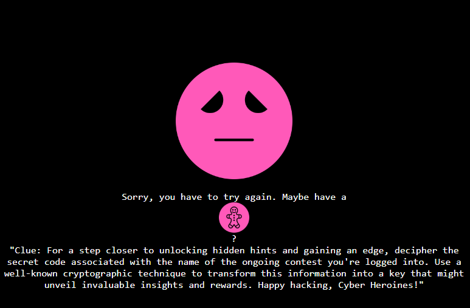

# CyberHeroines 2023

## Susan Landau

> [Susan Landau](https://en.wikipedia.org/wiki/Susan_Landau) (born 1954) is an American mathematician, engineer, cybersecurity policy expert, and Bridge Professor in Cybersecurity and Policy at the Fletcher School of Law and Diplomacy at Tufts University. She previously worked as a Senior Staff Privacy Analyst at Google. She was a Guggenheim Fellow and a visiting scholar at the Computer Science Department, Harvard University in 2012. - [Wikipedia Entry](https://en.wikipedia.org/wiki/Susan_Landau)

Chal: Connect to our webserver and understand the concerns of this mathematician and privacy expert.
>
>  Author: [Sneha](https://www.snehasudhakaran.com/)
>

Tags: _web_

## Solution
We get a small web application. When opening the link we get to a page with the following content:

```
Welcome to Cyberheroines CTF!
We're excited to have you here for this thrilling Capture The Flag event.

Get ready to test your hacking skills and uncover hidden challenges.

Start Exploring
```

When we click `Start Exploring` we end up at a page where we can enter a username. There is a comment saying:

```
"Welcome Cyber Heroine, you get more details when you don't choose your name to be heroine but your 'cyberheroine' username"
```

Afterwards we can choose between an `easy` or `difficult` path. The easy path seems to be a dead end. When choosing the difficult path we get one more comment and a button for help request.

```
You're on the right path. Keep going, and you'll find your treasure. Fingers crossed!
Request for help if needed, and keep exploring.
```

When requesting help (since we need it) we see.



There are a few hidden hints here. For one thing, the gingerbread man is a `cookie`. So we need a cookie, but which cookie and what's the value. The value is given in the hint as well.

```
decipher the secret code associated with the name of the ongoing contest you're logged into. Use a well-known cryptographic technique to transform this information into a key that might unveil invaluable insights and rewards
```

I had a hard time to understand this hint. It's linked to the note from the login page: `you get more details when you don't choose your name to be heroine but your 'cyberheroine' username"`. So the cookie value needs to be some encrypted form of the value `cyberheroine`.

Checking what cookies we have I noted that there are two `PHPSESSID` and `csrf_token`. Interestingly, the value of `csrf_token` never changed, putting it to `crackstation` we find that `40c331964b7560a4d3baaae420d5e3cd` is the MD5 hash for `hack this`.

Replacing the cookie with the md5 for `cyberheroine` and *then* requesting help gives the flag.

Flag `chctf{U_a53_$ucc3$$ful!!!}`