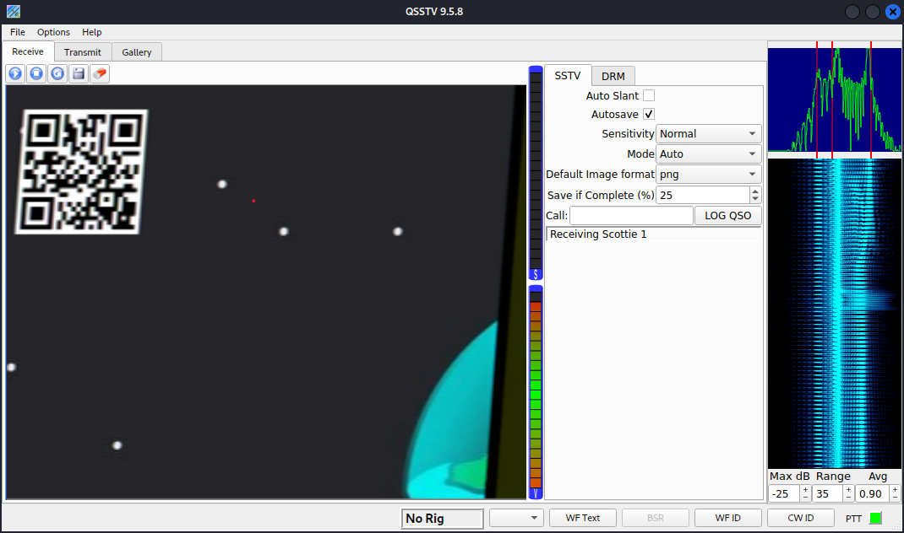

# DeconstruCT.F 2023

## Space Ahoy

> Brian tries to send some crucial information from the spacestation about an impending disaster through a super secure line to his friend through a picture.
Help his friend uncover the truth ..
>
>  Author: Rakhul
>
> [`super_secret.jpg`](super_secret.jpg)

Tags: _forensics_

## Solution
Another challenge another image with a secret. Running `exiftool` on it brings an interesting comment we take note of: `the aliens are here try slowscan`.

```bash
$ exiftool super_secret.jpg
ExifTool Version Number         : 12.41
File Name                       : super_secret.jpg
Directory                       : .
File Size                       : 9.4 MiB
File Modification Date/Time     : 2023:08:05 22:27:26+02:00
File Access Date/Time           : 2023:08:05 22:27:34+02:00
File Inode Change Date/Time     : 2023:08:05 22:27:32+02:00
File Permissions                : -rwxrwxrwx
File Type                       : JPEG
File Type Extension             : jpg
MIME Type                       : image/jpeg
JFIF Version                    : 1.01
Resolution Unit                 : None
X Resolution                    : 1
Y Resolution                    : 1
Comment                         : the aliens are here try slowscan
Image Width                     : 2394
Image Height                    : 1690
Encoding Process                : Baseline DCT, Huffman coding
Bits Per Sample                 : 8
Color Components                : 3
Y Cb Cr Sub Sampling            : YCbCr4:4:4 (1 1)
Image Size                      : 2394x1690
Megapixels                      : 4.0
```

Now running `binwalk` on the file to check for secret payloads.

```bash
$ binwalk -e super_secret.jpg
```

Yes, a new jpg called `hidden.jpg`. Sadly no flag is displayed, so we run `binwalk` also on this file.

```bash
$ binwalk -e hidden.jpg
```

Another hidden payload is extracted, this time a `wav`. Playing this file with an audio player we can listen to a lot of beeps. Definitely sounds like some kind of data transmission. Remembering the note we took at the beginning and googling for `slowscan` brings us new information [`Slow-scan television`](https://en.wikipedia.org/wiki/Slow-scan_television).

> Slow-scan television (SSTV) is a picture transmission method, used mainly by amateur radio operators, to transmit and receive static pictures via radio in monochrome or color.

So, this might be a transmission stream for a picture. For decoding we can find fitting `modem software`, also referenced in the wikipedia page. For instance [`QSSTV`](https://github.com/ON4QZ/QSSTV). Opening the `wav` in QSSTV reveils a image containing a QR code, and the QR code containing the flag.



Flag `dsc{un5af3_sp4C3_coD3}`