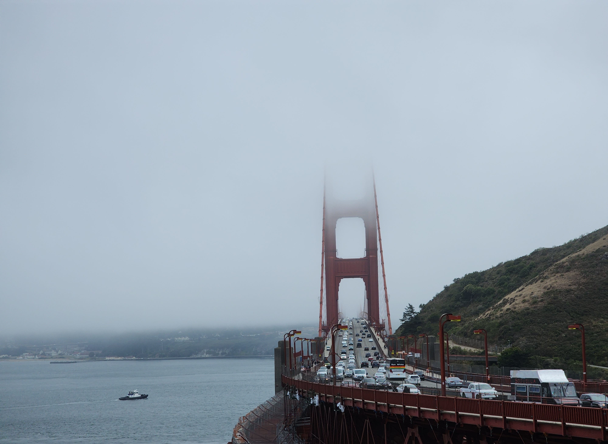
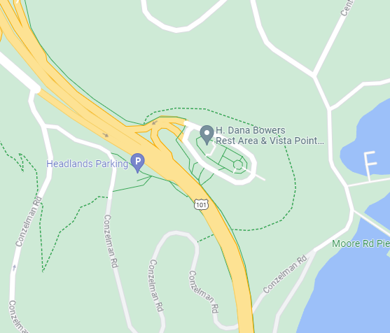

# DownUnderCTF 2023

## Bridget's Back!

> Bridget's travelling the globe and found this marvellous bridge, can you uncover where she took the photo from?
> 
> NOTE: Flag is case-insensitive and requires placing inside `DUCTF{}` wrapper! e.g `DUCTF{a_b_c_d_example}`
>
>  Author: Yo_Yo_Bro
>
> [`BridgetsBack.jpg`](BridgetsBack.jpg)

Tags: _osint_

## Solution
This image gives is a picture which displays `Golden Gate Bridge` in `San Francisco`.

 We can do a google reverse search and fine a image shot from a more or less identical angle but since it's clear that this is Golden Gate Bridge we can just go to Google Maps and check both ends of the bridge. From Streetview pictures, only the north-end really makes sense. So we need to check where the picture was made from.

 We find a vista point where the bridge bends which is `H. Dana Bowers Memorial Vista Point`. Putting with in the right format gives us the flag.

 

Flag `DUCTF{h_dana_bowers_memorial_vista_point}`