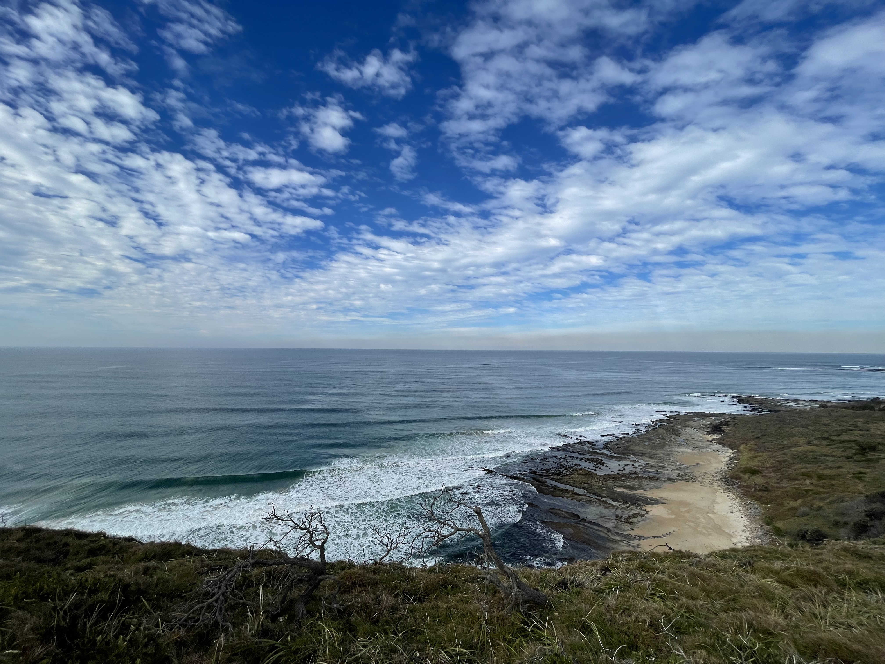
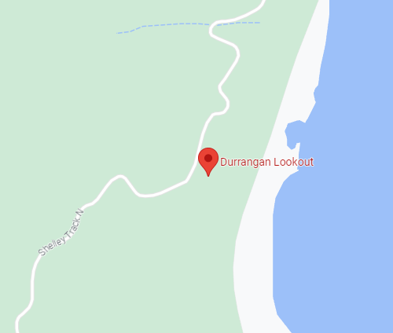

# DownUnderCTF 2023

## Excellent Vista!

> What a nice spot to stop,lookout and watch time go by, EXAMINE the image and discover where this was taken.
> 
> NOTE: Flag is case-insensitive and requires placing inside `DUCTF{}` wrapper! e.g `DUCTF{Osint_Lookout}`
>
>  Author: Yo_Yo_Bro
>
> [`ExcellentVista.jpg`](ExcellentVista.jpg)

Tags: _osint_

## Solution
In the description is hinted that we need to examine the image. Doing this by running `exiftool` on it gives us the coordinates where the image was created.



```bash
$ exiftool ExcellentVista.jpg
GPS Altitude                    : 70.5 m Above Sea Level
GPS Latitude                    : 29 deg 30' 34.33" S
GPS Longitude                   : 153 deg 21' 34.46" E
GPS Position                    : 29 deg 30' 34.33" S, 153 deg 21' 34.46" E
```

Going to this location with google maps puts us [`https://www.google.de/maps/place/29%C2%B030'34.3%22S+153%C2%B021'34.5%22E/@-29.5095314,153.3569973,17z/data=!4m4!3m3!8m2!3d-29.5095361!4d153.3595722?entry=ttu`](here) and gives us the name of the lookout.



Flag `DUCTF{Durrangan_Lookout}`