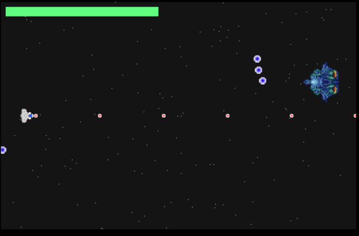

# DownUnderCTF 2023

## SPACEGAME

> ALL YOUR BASE ARE BELONG TO US. YOU ARE ON THE WAY TO DESTRUCTION.
>
>  Author: hashkitten
>
> [`SPACEGAME.zip`](SPACEGAME.zip)

Tags: _rev_

## Solution
This challenge comes with a simple space game.



The game seems to use the [`https://love2d.org/`](LÖVE) engine. The engine packages engine core functionality to `love.dll` and game specific functionality to `SPACEGAME.exe`. The rest of the dependencies are not relevant here. 

After some inspection I saw that the engine uses `Lua` as scripting language and all game specific code is written in Lua. The scripts from `love.dll` are nice but not too helpful and can be found in original [`here`](https://github.com/love2d/love/tree/main/src/scripts) and [`here`](https://github.com/love2d/love/tree/main/src/modules/love). The whole game architecture is kind if interesting, but we are loosing our target here.

From `SPACEGAME.exe` we can extract more resources and Lua scripts with `binwalk`. The scripts here are obfuscated and not really readable. Part of the obfuscation is to encode strings. The encoded strings are stored in a big array:

```lua
return (function(...)
    local s = {
        "\089\099\043\061",
        "\107\111\082\097\052\085\114\049\108\111\110\074\110\113\061\061",
        "\107\077\086\121",
        "\070\077\086\088\110\079\082\055\089\085\120\049",
        "\108\099\113\061",
        "\070\079\082\072\070\116\080\061",
        "\070\097\061\061",
        "\098\050\047\075\069\050\089\119\069\086\086\121\047\049\098\072\080\076\061\061",
        "\047\082\086\050\086\056\089\071\069\111\073\090\070\049\073\057\107\121\086\075\107\077\086\112\052\085\049\067\052\085\073\085\089\052\102\118\119\109\082\049\119\088\070\075\080\085\047\073",
        "\108\052\098\048\089\111\082\048",
        "\108\111\112\067\089\052\102\122",
        "\107\079\073\085\089\076\061\061",
        -- ...
    }
```

And bellow that is some code working on the array, first decoding to some base encoded string and then decoding to ascii. The function `O` is used within the remaining code to look up strings from the array.

```lua
    for O, p in ipairs({{1, 58}, {1, 28}, {29, 58}}) do
        while p[1] < p[2] do
            s[p[1]], s[p[2]], p[1], p[2] = s[p[2]], s[p[1]], p[1] + 1, p[2] - 1
        end
    end
    local function O(O)
        return s[O - 26364]
    end
    do
        local O = s
        local p = string.sub
        local L = table.concat
        local A = string.char
        local W = {
            D = 47,
            w = 24,
            R = 5,
            -- ...
        }
        local c = string.len
        local V = math.floor
        local X = type
        local S = table.insert
        for s = 1, #O, 1 do
            local M = O[s]
            if X(M) == "\115\116\114\105\110\103" then
                local X = c(M)
                local k = {}
                local Y = 1
                local o = 0
                local y = 0
                while Y <= X do
                    local s = p(M, Y, Y)
                    local O = W[s]
                    if O then
                        o = o + O * 64 ^ (3 - y)
                        y = y + 1
                        if y == 4 then
                            y = 0
                            local s = V(o / 65536)
                            local O = V((o % 65536) / 256)
                            local p = o % 256
                            S(k, A(s, O, p))
                            o = 0
                        end
                    elseif s == "\061" then
                        S(k, A(V(o / 65536)))
                        if Y >= X or p(M, Y + 1, Y + 1) ~= "\061" then
                            S(k, A(V((o % 65536) / 256)))
                        end
                        break
                    end
                    Y = Y + 1
                end
                O[s] = L(k)
            end
        end
    end
```

We can easily dump the decoded table by adding some lines of code:

```lua
for i,k in ipairs(r) do
        print(k)
end
```

And we find the flag in plain text in boss.lua:

```bash
$ lua decode_strings.lua
tile_size
internaltimer
nextattack
newImage
...
pairs
s
44rx6XyUwFSi1
DUCTF{your_journey_is_over_a1eb723d}
isdead
insert
love
audio
newSource
attacktype
...
```

Flag `DUCTF{your_journey_is_over_a1eb723d}`