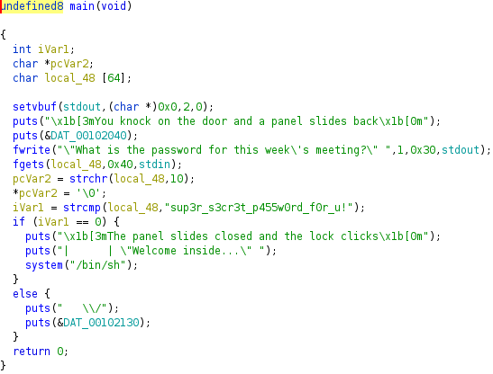

# Hack The Boo 2022

## Cult Meeting

> After months of research, you're ready to attempt to infiltrate the meeting of a shadowy cult. Unfortunately, it looks like they've changed their password!
>
>  Author: N/A
>
> [`rev_cult_meeting.zip`](rev_cult_meeting.zip)

Tags: _rev_

## Preparation
First thing is to extract *rev_cult_meeting.zip* and check the contents. There is one file in *rev_cult_meeting/meeting*. Quickly checking the contents 

```
$file meeting
meeting: ELF 64-bit LSB pie executable, x86-64, version 1 (SYSV), dynamically linked, interpreter /lib64/ld-linux-x86-64.so.2, BuildID[sha1]=72d8b06e4ca750d5c24395d3349c3121b9b95283, for GNU/Linux 3.2.0, not stripped
```

So as expected an executable that can easily be inspected with *Ghidra*. After opening with Ghidra and browsing to *main* the following Pseudocode is provided



The critical part is clearly visible, after the user input is checked to be equivalent to *sup3r_s3cr3t_p455w0rd_f0r_u!* a shell is spawned. So trying this on the server

```
$nc 142.93.35.129 31630
You knock on the door and a panel slides back
|/👁️ 👁️ \|   A hooded figure looks out at you
"What is the password for this week's meeting?" sup3r_s3cr3t_p455w0rd_f0r_u!
sup3r_s3cr3t_p455w0rd_f0r_u!
The panel slides closed and the lock clicks
|      | "Welcome inside..."
/bin/sh: 0: can't access tty; job control turned off
```

With the shell, inspect the current folder
```
$ ls
ls
flag.txt  meeting
```

The flag is right here to cat
```
$ cat flag.txt
cat flag.txt
HTB{1nf1ltr4t1ng_4_cul7_0f_str1ng5}
```

