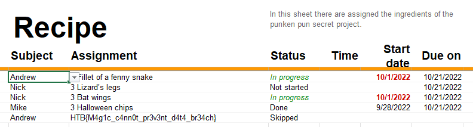

# Hack The Boo 2022

## Trick or Breach

> Our company has been working on a secret project for almost a year. None knows about the subject, although rumor is that it is about an old Halloween legend where an old witch in the woods invented a potion to bring pumpkins to life, but in a more up-to-date approach. Unfortunately, we learned that malicious actors accessed our network in a massive cyber attack. Our security team found that the hack had occurred when a group of children came into the office's security external room for trick or treat. One of the children was found to be a paid actor and managed to insert a USB into one of the security personnel's computers, which allowed the hackers to gain access to the company's systems. We only have a network capture during the time of the incident. Can you find out if they stole the secret project?
>
>  Author: N/A
>
> [`forensics_trick_or_breach.zip`](forensics_trick_or_breach.zip)

Tags: _forensics_

## Preparation
Again a pcap file is provided that can be inspected with Wireshark. The stream shown is only DNS packages with not too much space to hide information. One thing standing out are the long and crypting subdomain names in the queries.

```
0000   e8 1b 69 5b 0f 60 64 bc 58 93 fa 2b 08 00 45 00   ..i[.`d.X..+..E.
0010   00 70 e1 e5 00 00 80 11 56 71 c0 a8 01 0a 93 b6   .p......Vq......
0020   ac bd c9 ba 00 35 00 5c ae 2b dd 23 00 00 00 01   .....5.\.+.#....
0030   00 00 00 00 00 00 32 30 30 31 38 30 30 30 30 30   ......2001800000
0040   30 37 38 36 63 32 66 36 34 37 32 36 31 37 37 36   0786c2f647261776
0050   39 36 65 36 37 37 33 32 66 36 34 37 32 36 31 37   96e67732f6472617
0060   37 36 39 36 65 36 37 33 31 0b 70 75 6d 70 6b 69   7696e6731.pumpki
0070   6e 63 6f 72 70 03 63 6f 6d 00 00 01 00 01         ncorp.com.....
```

This looks suspiciously like an hex string. Sampling some of the names and converting them the strings shows indeed some readable text (and a lot of noise) to turn up. So to extract the data from pcap a quick python script is the best.

```python
import pyshark
import re

cap = pyshark.FileCapture("capture.pcap")
cap.load_packets()
message = ""
for i in range(0,len(cap)-1,2):
    foo = cap[i].dns.qry_name[:-16]
    message = message + foo

print(message)
```

Next up, converting the resulting block from hex using Cybershef and downloading the binary blob. Running the *file* command on the blob reveals that the data is an Excel Sheet.

```
$ file data
data: Microsoft Excel 2007+
```

So opening the file in Excel indeed reveals the flag

