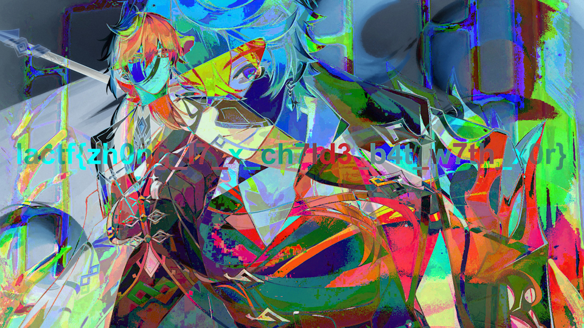

# LACTF 2023

## infinite loop

> I found this google form but I keep getting stuck in a loop! Can you leak to me the contents of form and the message at the end so I can get credit in my class for submitting? Thank you!
> 
> Author: burturt
> 

Tags: _misc_

## Solution
A `google form` is given, when starting to fill out we note that it contains a loop and we can never finish the form. Browsing the page source gives us the flag though.

Flag `lactf{l34k1ng_4h3_f04mz_s3cr3tz}`

## mixed signals

> **NOTE: Unfortunately we goofed up and uploaded the wrong file. As it's too late into the CTF to fix, we will be leaving the challenge as-is. Yes, you can just hear the flag in the audio file directly.**
I can't figure out what my friend is trying to tell me. They sent me this recording and told me that the important stuff is at 40 kHz (??? what does that even mean).

[`This may be useful`](https://en.wikipedia.org/wiki/Amplitude_modulation). Flag format is lactf{xxx} with only lower case letters, numbers, and underscores between the braces.
> 
> Author: AVDestroyer
> 
> [`message.wav`](message.wav)

Tags: _misc_

## Solution
As the description mentions. The challenge was broken, the flag could just be listened to.

Flag `lactf{c4n_y0u_plz_unm1x_my_s1gn4lz}`

## gacha

> All my friends have been getting into genshin and honkai recently and keep sending me pictures. However, they keep hiding their favorite characters, demanding for more money for their gacha pulls.
> 
> Can you free zhongli my waifu???
> 
> Author: r2uwu2
> 
> [`package.sh`](package.sh)
> [`chall.zip`](chall.zip)

Tags: _misc_

## Solution

A zip archive with three png images is given and the `package` script. We can see that the flag is written to `uwu.png` and then `uwu.png` and `owo.png` are encrypted. A quick google search tells us that `ImageMagick` uses a AES flavour for encryption. Xoring both encrypted images (I just used [`Paint.NET`](https://www.getpaint.net/) to xor the layers), gave the flag.



```sh
#!/bin/sh
dd if=/dev/urandom ibs=1 count=128 > secret.key
rm -rf chall
mkdir -p chall
cp img/fiscl.png chall/

# add flag to uwu
magick img/uwu.png \
    -weight 50000 -fill red -pointsize 96 \
    -draw "text 50,540 '`cat flag.txt`'" \
    PNG24:flag.png

magick img/owo.png -encipher secret.key chall/owo.png
magick flag.png -encipher secret.key chall/uwu.png
rm flag.png

rm -f chall.zip
zip -9r chall.zip chall/
```

Flag `lactf{zh0ng_l7_x_ch7ld3_b4t_w7th_x0r}`