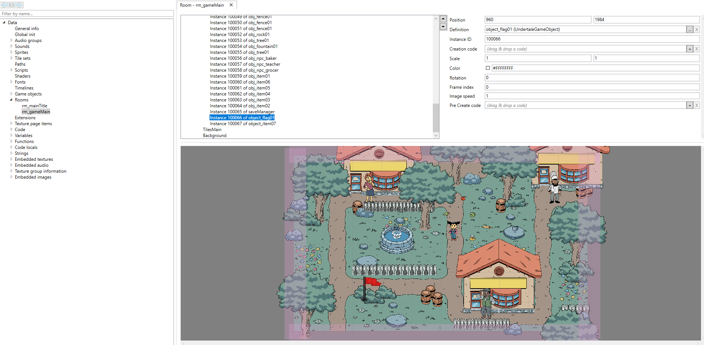
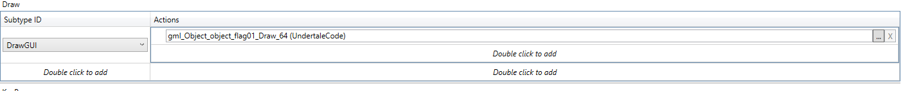
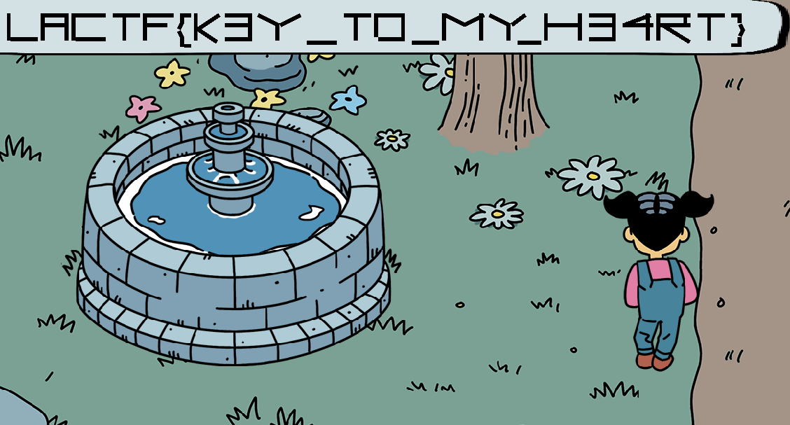

# LACTF 2023

## flag-finder

> Speak with the almighty flag. Perhaps if you find an item it likes, it will be willing to share some of its knowledge? I'm sure it's in the room somewhere... Note: Enter the flag using all lowercase. M1/M2 Macs must use Rosetta.
> 
> Author: oh worm
> 

Tags: _rev_

## Solution
After extracting the archive we find three files. One called `data.win`, an executable and a `options.ini`. This looks like a game, from here we need to know if a commonly known `Game Engine` or `Game SDK` was used to create this. Running `strings` on the executable brings results that suggest the engine used was `GameMaker`.

```bash
D:\a\GameMaker\GameMaker\GameMaker\Runner\VC_Runner\x64\Release-Zeus\Runner.pdb
```

For GameMaker [`UndertaleModTool`](https://github.com/krzys-h/UndertaleModTool) can be used. This allows us to basically inspect the whole game. Looking at the `rooms` we can see the game workd and inside a pretty obvious `flag`.



Inspecting the flag object definition, we find the flag inherits from `obj_par_npc`. NPCs have a set of properties they are initialized with, one is a `myState` that is set to `0`.

```javascript
event_inherited()
loopRange01 = 30
loopRange02 = 240
myText = "Why, hello there!"
myItem = -4
itemTextHappy = "Text for the right item."
itemTextSad = "Text for the wrong item."
itemTextDone = "Thank you text."
sequenceHappy = -4
sequenceSad = -4
myState = (0 << 0)
doneSprite = -4
```

The flag overrides some of the properties.

```javascript
event_inherited()
myText = "You want the flag? Find me the key. I'm sure it's somewhere in this room..."
myItem = 20
itemTextHappy = "Oh sweet, that's exactly what I was looking for!"
itemTextSad = "Wrong item... smh"
itemTextDone = "Thanks again :D"
```

Also the flag bind code to a `DrawGUI` event. The code generates a sprite with drawing a bunch of lines to it. This is only done if `myState` has the value `1`. But we remember that `myState` was initialized to value `0`.



```javascript
switch myState
{
    case (1 << 0):
        draw_sprite_ext(spr_gui_textbox, 1, 540, 40, 2.5, 0.29999999999999999, 0, c_white, 1)
        self.draw_sprite_line(60, 1, 20, 20, 20, 60)
        self.draw_sprite_line(60, 1, 20, 55, 60, 55)
        self.draw_sprite_line(60, 1, 70, 20, 70, 60)
        self.draw_sprite_line(60, 1, 70, 20, 105, 20)
        self.draw_sprite_line(60, 1, 105, 20, 105, 60)
        self.draw_sprite_line(60, 1, 70, 35, 105, 35)
        self.draw_sprite_line(60, 1, 115, 20, 115, 60)
        self.draw_sprite_line(60, 1, 115, 20, 160, 20)
        self.draw_sprite_line(60, 1, 115, 55, 160, 55)
        self.draw_sprite_line(60, 1, 170, 20, 210, 20)
        self.draw_sprite_line(60, 1, 190, 20, 190, 60)
        self.draw_sprite_line(60, 1, 220, 20, 220, 60)
        self.draw_sprite_line(60, 1, 220, 20, 260, 20)
        self.draw_sprite_line(60, 1, 220, 35, 250, 35)
        self.draw_sprite_line(60, 1, 275, 20, 285, 20)
        self.draw_sprite_line(60, 1, 275, 20, 275, 35)
        self.draw_sprite_line(60, 1, 275, 35, 270, 45)
        self.draw_sprite_line(60, 1, 270, 45, 275, 55)
        self.draw_sprite_line(60, 1, 275, 55, 275, 70)
        self.draw_sprite_line(60, 1, 275, 65, 285, 65)
        self.draw_sprite_line(60, 1, 295, 20, 295, 60)
        self.draw_sprite_line(60, 1, 295, 40, 325, 60)
        self.draw_sprite_line(60, 1, 295, 40, 325, 20)
        self.draw_sprite_line(60, 1, 335, 20, 375, 20)
        self.draw_sprite_line(60, 1, 335, 35, 375, 35)
        self.draw_sprite_line(60, 1, 335, 55, 375, 55)
        self.draw_sprite_line(60, 1, 375, 20, 375, 55)
        self.draw_sprite_line(60, 1, 385, 20, 415, 35)
        self.draw_sprite_line(60, 1, 415, 35, 445, 20)
        self.draw_sprite_line(60, 1, 415, 35, 415, 60)
        self.draw_sprite_line(60, 1, 455, 60, 500, 60)
        self.draw_sprite_line(60, 1, 510, 20, 550, 20)
        self.draw_sprite_line(60, 1, 530, 20, 530, 60)
        self.draw_sprite_line(60, 1, 560, 20, 600, 20)
        self.draw_sprite_line(60, 1, 560, 55, 600, 55)
        self.draw_sprite_line(60, 1, 560, 20, 560, 55)
        self.draw_sprite_line(60, 1, 600, 20, 600, 55)
        self.draw_sprite_line(60, 1, 610, 60, 650, 60)
        self.draw_sprite_line(60, 1, 660, 20, 660, 60)
        self.draw_sprite_line(60, 1, 660, 20, 690, 35)
        self.draw_sprite_line(60, 1, 685, 35, 715, 20)
        self.draw_sprite_line(60, 1, 715, 20, 715, 60)
        self.draw_sprite_line(60, 1, 725, 20, 755, 35)
        self.draw_sprite_line(60, 1, 755, 35, 775, 20)
        self.draw_sprite_line(60, 1, 755, 35, 755, 60)
        self.draw_sprite_line(60, 1, 765, 60, 800, 60)
        self.draw_sprite_line(60, 1, 810, 20, 810, 60)
        self.draw_sprite_line(60, 1, 810, 35, 860, 35)
        self.draw_sprite_line(60, 1, 860, 20, 860, 60)
        self.draw_sprite_line(60, 1, 870, 20, 910, 20)
        self.draw_sprite_line(60, 1, 870, 35, 910, 35)
        self.draw_sprite_line(60, 1, 870, 55, 910, 55)
        self.draw_sprite_line(60, 1, 910, 20, 910, 55)
        self.draw_sprite_line(60, 1, 920, 35, 965, 35)
        self.draw_sprite_line(60, 1, 920, 35, 960, 20)
        self.draw_sprite_line(60, 1, 960, 20, 960, 60)
        self.draw_sprite_line(60, 1, 975, 20, 975, 60)
        self.draw_sprite_line(60, 1, 975, 20, 1020, 20)
        self.draw_sprite_line(60, 1, 1015, 20, 1015, 35)
        self.draw_sprite_line(60, 1, 975, 35, 1020, 35)
        self.draw_sprite_line(60, 1, 980, 35, 1020, 60)
        self.draw_sprite_line(60, 1, 1030, 20, 1070, 20)
        self.draw_sprite_line(60, 1, 1050, 20, 1050, 60)
        self.draw_sprite_line(60, 1, 1080, 20, 1095, 20)
        self.draw_sprite_line(60, 1, 1095, 20, 1095, 35)
        self.draw_sprite_line(60, 1, 1095, 35, 1100, 45)
        self.draw_sprite_line(60, 1, 1100, 45, 1095, 55)
        self.draw_sprite_line(60, 1, 1095, 55, 1095, 70)
        self.draw_sprite_line(60, 1, 1095, 70, 1080, 70)
        break
}
```

Well, that can be chanced quickly by adapting the initialization code for the flag.

```javascript 
event_inherited()
myText = "You want the flag? Find me the key. I'm sure it's somewhere in this room..."
myItem = 20
itemTextHappy = "Oh sweet, that's exactly what I was looking for!"
itemTextSad = "Wrong item... smh"
itemTextDone = "Thanks again :D"
myState = 1
```



Another method could be to just extract the draw code. Its fairly simple and can be done easily.

```python
from PIL import Image, ImageDraw
from lines import l #l being an array of the points extracted before

im = Image.new('RGB', (2000, 100))

draw = ImageDraw.Draw(im)

for i in range(0, len(l), 4):
    x0 = l[i]
    y0 = l[i+1]
    x1 = l[i+2]
    y1 = l[i+3]
    draw.line((x0,y0, x1,y1))

im.save('test.png')
```


Flag `lactf{k3y_to_my_h34rt}`