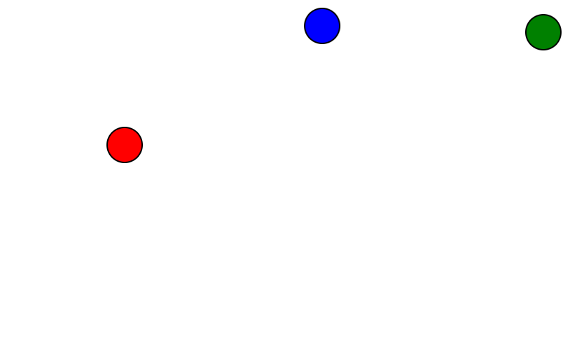

# LACTF 2023

## pogn

> Pogn in mong.
> 
> Author: r2uwu2
> 
> [`pogn.zip`](pogn.zip)

Tags: _web_

## Solution
The given web-app is a implementation of [`Pong`](https://en.wikipedia.org/wiki/Pong). The game runs on the server and the client only sends paddle movement for server calculation. The code is fairly simple, when the mouse moves the position `userPos` and and paddle velocity `v` are computed and send in a fixed interval.



```javascript
let moved = false;
let p_x = 0;
let p_y = 0;
let v = [0, 0];
window.addEventListener('mousemove', (e) => {
  moved = true;
  const x = clamp(e.clientX, 0, innerWidth / 2 - 48);
  const y = e.clientY;
  userPaddle.style = `--x: ${x}px; --y: ${y}px`;
  userPos = viewportToServer([ x, y ]);
  v = viewportToServer([0.01 * (x - p_x), 0.01 * (y - p_y)]);
  p_x = x;
  p_y = y;
});
```

```javascript
const interval = setInterval(() => {
    if (!moved) return;
    ws.send(JSON.stringify([
      Msg.CLIENT_UPDATE,
      [ userPos, v ]
    ]));
  }, 50);
```

This being the only input should be our target to concentrate on. Velocity sounds somewhat interesting. If the velocity is used to control the ball speed, after collision with the players paddle, we could set it to something huge. But trying this doesnt work. So lets inspect the server code as well. When the server receives the client message the velocity vector is normalized. Thats the reason why a velocity scaled by a huge value doesn't really work here. Normalize though is defined as `const normalize = (v) => mul(v, 1 / norm(v));` and `norm` is defined as `const norm = ([x, y]) => Math.sqrt(x ** 2 + y ** 2);`. This is a typical issue in game-dev, since `norm` can return `0` for a `0-vector` this leads to a division by zero in `normalize` causing a `[NaN, NaN]` vector.

```javascript
ws.on('message', (data) => {
    try {
      const msg = JSON.parse(data);
      if (msg[0] === Msg.CLIENT_UPDATE) {
        const [ paddle, paddleV ] = msg[1];
        if (!isNumArray(paddle) || !isNumArray(paddleV)) return;
        op = [clamp(paddle[0], 0, 50), paddle[1]];
        opV = mul(normalize(paddleV), 2);
      }
    } catch (e) {}
  });
```

Manipulating the client code to send a `0-vector` as velocity gives us the flag.

```javascript
const interval = setInterval(() => {
    if (!moved) return;
    ws.send(JSON.stringify([
      Msg.CLIENT_UPDATE,
      [ userPos, [0,0] ]
    ]));
  }, 50)
```

Flag `lactf{7_supp0s3_y0u_g0t_b3773r_NaNaNaN}`