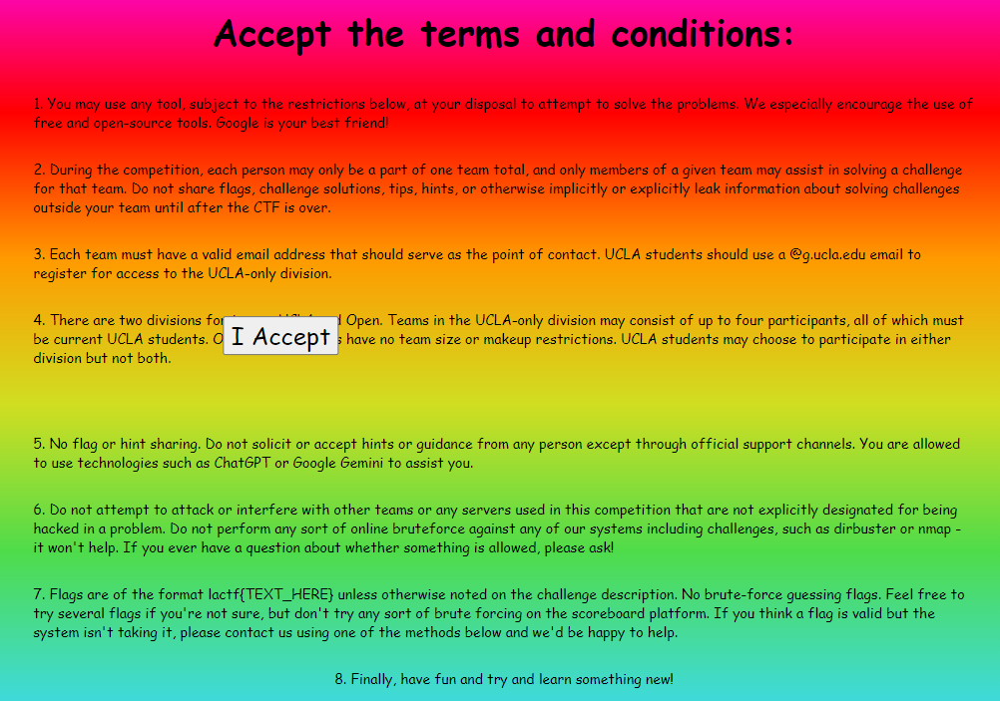

# LACTF 2023

## terms-and-conditions

> Welcome to LA CTF 2024! All you have to do is accept the terms and conditions and you get a flag!
> 
> Author: aplet123
> 

Tags: _web_

## Solution
We get a very colorful static page where we'r supposed to click the `I Accept` button. The button though moves away from our mousepointer. So lets inspect the page source.



```javascript
const accept = document.getElementById("accept");
            document.body.addEventListener("touchstart", (e) => {
                document.body.innerHTML = "<div><h1>NO TOUCHING ALLOWED</h1></div>";
            });
            let tx = 0;
            let ty = 0;
            let mx = 0;
            let my = 0;
            window.addEventListener("mousemove", function (e) {
                mx = e.clientX;
                my = e.clientY;
            });
            setInterval(function () {
                const rect = accept.getBoundingClientRect();
                const cx = rect.x + rect.width / 2;
                const cy = rect.y + rect.height / 2;
                const dx = mx - cx;
                const dy = my - cy;
                const d = Math.hypot(dx, dy);
                const mind = Math.max(rect.width, rect.height) + 10;
                const safe = Math.max(rect.width, rect.height) + 25;
                if (d < mind) {
                    const diff = mind - d;
                    if (d == 0) {
                        tx -= diff;
                    } else {
                        tx -= (dx / d) * diff;
                        ty -= (dy / d) * diff;
                    }
                } else if (d > safe) {
                    const v = 2;
                    const offset = Math.hypot(tx, ty);
                    const factor = Math.min(v / offset, 1);
                    if (offset > 0) {
                        tx -= tx * factor;
                        ty -= ty * factor;
                    }
                }
                accept.style.transform = `translate(${tx}px, ${ty}px)`;
            }, 1);
            let width = window.innerWidth;
            let height = window.innerHeight;
            setInterval(function() {
                if (window.innerHeight !== height || window.innerWidth !== width) {
                    document.body.innerHTML = "<div><h1>NO CONSOLE ALLOWED</h1></div>";
                    height = window.innerHeight;
                    width = window.innerWidth;
                }
            }, 10);
```

There's a very naive anti debuggin technique implemented. When the browser window changes in size `NO CONSOLE ALLOWED` is displayed. This can be shipped around by just refreshing the page or undocking the `developer tools panel`.

The button movement is done via `setInterval`. Therefore clearing the interval would keep the button in place. Another solution would be to trigger the click event via console. Either way, we get the flag.

```javascript
> clearInterval(1)
< undefined
```

```javascript
> document.getElementById("accept").click()
< undefined
```

Flag `lactf{that_button_was_definitely_not_one_of_the_terms}`