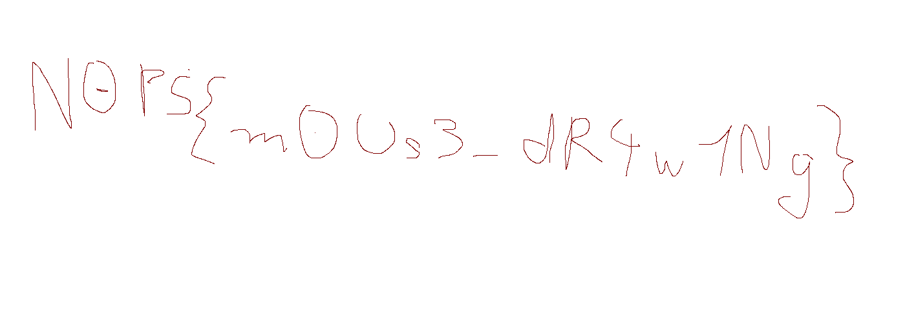

# N0PSctf 2024

## HID

> what did I write ???
> 
> Author: algorab
> 
> [`capture.pcapng`](capture.pcapng)

Tags: _rev_

## Solution
The challenge comes with a network traffic capture. Opening it reveals that the communication of USB devices was captures. Looking at the challenge description we assume that we are looking for data coming from an USB keyboard. Browsing the capture, sadly we don't find keyboard packets but we find a lot of `URB_INTERRUPT` with, what appears to be [`HID data coming from a mouse`](https://www.usb.org/sites/default/files/documents/hut1_12v2.pdf).

All the interesting packages are coming from [`USB request block id`](https://docs.kernel.org/driver-api/usb/URB.html) `0xffff9078f87ca240`, so we start filtering for those packets. Because, maybe, the recorded mouse movement will give us further information?

```python
import dpkt, struct

URB_ID = 0xffff9078f87ca240
MOUSE_PACKAGE_SIZE = 7

mouse_info = []

with open("capture.pcap", "rb") as file:
    pcap = dpkt.pcap.Reader(file)

    for _, buffer in pcap:
        packet_urb_id = struct.unpack_from("<Q", buffer, offset=0)[0]
        if packet_urb_id != URB_ID:
            continue

        data_length = struct.unpack_from("<I", buffer, offset=0x24)[0]
        if data_length != MOUSE_PACKAGE_SIZE:
            continue

        buttonState = buffer[0]
        offsetX = struct.unpack_from("<h", buffer, offset=0x40+2)[0]
        offsetY = struct.unpack_from("<h", buffer, offset=0x40+4)[0]
        mouse_info.append((buttonState, offsetX, offsetY))

print(mouse_info)
```

This looks good, we have a lot of packages we can reconstruct the mouse movement from.

```bash
[(64, -1, -1), (64, -1, -1), (64, -1, 0), (64, -1, 0), (64, 1, 0), (64, 1, 0), ...
```

Best not to do this by hand though, but let python do this for us. For this we compute the mouse movement after each package and draw lines between the positions if the left button is pressed. The full script can be found bellow.

```python
import dpkt, struct
from PIL import Image, ImageDraw

URB_ID = 0xffff9078f87ca240
MOUSE_PACKAGE_SIZE = 7
WIDTH = 1400
HEIGHT = 500

mouse_info = []

with open("capture.pcap", "rb") as file:
    pcap = dpkt.pcap.Reader(file)

    for _, buffer in pcap:
        packet_urb_id = struct.unpack_from("<Q", buffer, offset=0)[0]
        if packet_urb_id != URB_ID:
            continue

        data_length = struct.unpack_from("<I", buffer, offset=0x24)[0]
        if data_length != MOUSE_PACKAGE_SIZE:
            continue

        buttonState = buffer[0x40+1]
        offsetX = struct.unpack_from("<h", buffer, offset=0x40+2)[0]
        offsetY = struct.unpack_from("<h", buffer, offset=0x40+4)[0]
        mouse_info.append((buttonState, offsetX, offsetY))

img = Image.new("RGB", (WIDTH, HEIGHT), (255,255,255))
canvas = ImageDraw.Draw(img)

posX = 300
posY = HEIGHT // 2

for state, x, y in mouse_info:

    newPosX = posX + x
    newPosY = posY + y

    if state & 1 != 0:
        canvas.line((posX, posY, newPosX, newPosY), fill=128)

    posX = newPosX
    posY = newPosY

img.save("output.png")
```



Flag `N0PS{m0Us3_dR4w1Ng}`