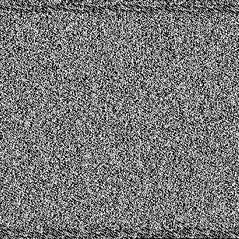

# N0PSctf 2024

## Meaningful Noise

> iz dat a qRcOdE?
> 
> Author: algorab
> 
> [`pxls.png`](pxls.png)

Tags: _misc_

## Solution
This challenge we get a beatiful image.



First thing I tried is to see if the noise will form any meaningful information with a different image with, but nope...

Next thing is to read the pixels and see if they represent single bits in a data stream (like black is a 0-bit and white a 1-bit).

```python
from PIL import Image

img = Image.open("pxls.png")
data = img.load()

bits = ""

for y in range(img.height):
    for x in range(img.width):
        rgb = data[x,y]
        bits += "0" if rgb == 0 else "1"

buffer = bytes([int(bits[i:i+8],2) for i in range(0, len(bits), 8)])
print(buffer.decode())
```

```bash
iVBORw0KGgoAAAANSUhEUgAAApYAAACyCAIAAAB3MhhUAAAACXBIWXMAAA7EAAAOxAGVKw4bAAAg
AElEQVR4nO3dd3xcV5k38HPvnd6LRr3akmxLtuJeYieOHUM2BRIgISENCCX7foBd2IVlCbvwLkvZ
LCyfBT7L0kIIJkAKYUPYhJDiJI6d2E7cJDdZltXLjDS9z9x73z+UV7pz73SNRrri9/34j2Q80lzJ
M/c55znPe...
```

This looks actually very good as this is obviously base64 encoded data. Lets decode this also.

```python
from PIL import Image
from base64 import b64decode

img = Image.open("pxls.png")
data = img.load()

bits = ""

for y in range(img.height):
    for x in range(img.width):
        rgb = data[x,y]
        bits += "0" if rgb == 0 else "1"

buffer = bytes([int(bits[i:i+8],2) for i in range(0, len(bits), 8)])
open("output", "wb").write(b64decode(buffer))
```

The decoded output is again a png image, containing the flag.

```bash
$ file output
output: PNG image data, 662 x 178, 8-bit/color RGB, non-interlaced
```


Flag `N0PS{b1n4rY_4s_P1x3Lz}`