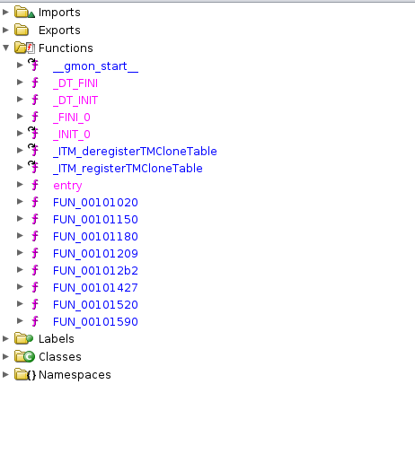
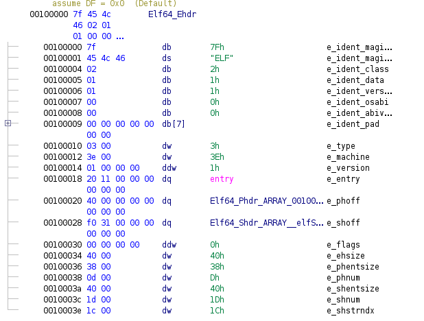
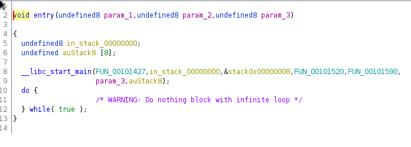
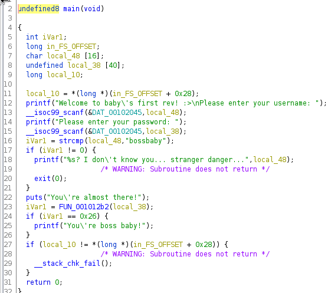
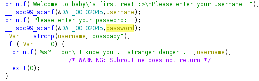
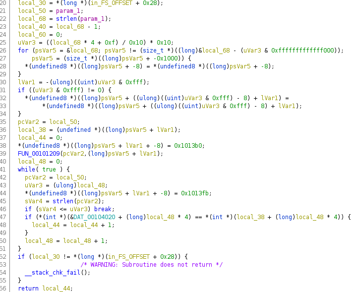
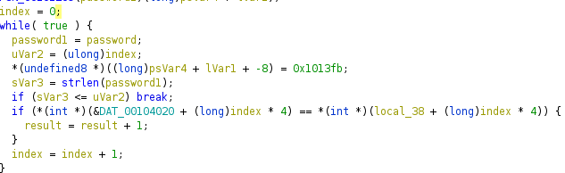
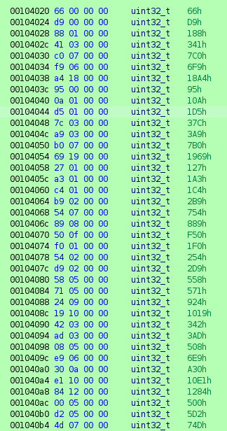
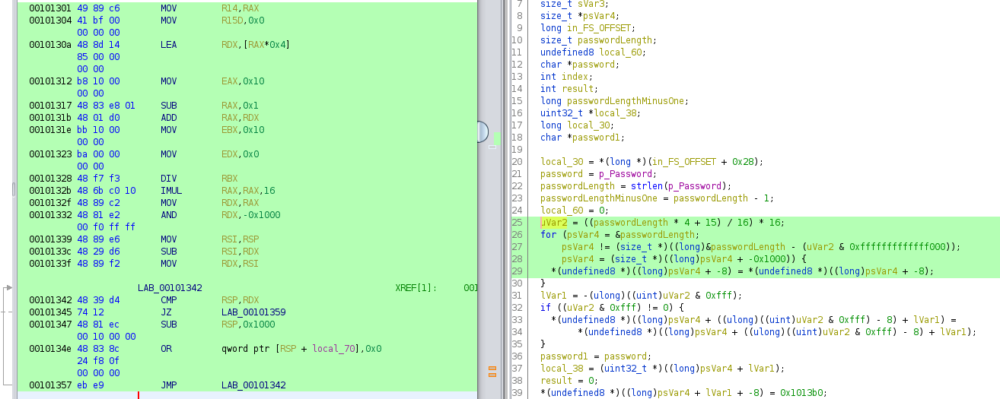
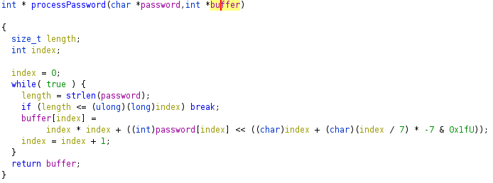

# NahamCon CTF 2022

## babyrev

> Aw look! Baby is using a disassembler!
>
> Author: @birch#9901
>
> [`babyrev`](babyrev)

Tags: _rev_

## Preparation
First of, we download the file and check what content this file has. We can do this easily by using the 'file' command
```
> file babyrev

babyrev: ELF 64-bit LSB pie executable, x86-64, version 1 (SYSV), dynamically linked, interpreter /lib64/ld-linux-x86-64.so.2, BuildID[sha1]=1a48d52c4e5d664115f6cd11651f9c688e8198db, for GNU/Linux 3.2.0, stripped
```
So we have an ELF file containing a executable. The executable is stripped, thus doesn't contain debug informations anymore. 

After we know that it's an executable file, we can try to run the programm.
```
> chmod +x babyrev
> ./babyrev
Welcome to baby's first rev! :>
Please enter your username: hello
Please enter your password: world
hello? I don't know you... stranger danger...
```
So the application asks for an username and a password. Since we don't know neither username nor password we need to inspect the executable further.

## Inspection
To inspect further we use whatever tool fits our needs. I use Ghidra in this case. 

Since the executable is stripped we don't see much information and functions are displayed with generic names. 


In this case we just start from the entry point following the call-chain. The entry point can be found in the ELF header and is called after the file and dependencies are loaded and everything is setup to run the program (read more [here](https://lwn.net/Articles/631631/)). Ghidra is kindly showing it to us in the function list.



### Inspecting 'entry'



The function is not doing too much but just calling __libc_start_main. We can lookup the function signature to get an understanding what's passed into the function.
```
int __libc_start_main(int *(main) (int, char * *, char * *), int argc, char * * ubp_av, void (*init) (void), void (*fini) (void), void (*rtld_fini) (void), void (* stack_end));
```

With this we can reason about some of the functions of the application. The first parameter is a pointer to the program's 'main' function. The other functions are there to setup the execution environment for our executable. You can readup more in this  [here](https://refspecs.linuxbase.org/LSB_3.1.0/LSB-generic/LSB-generic/baselib---libc-start-main-.html).

Now we can rename the known functions in Ghidra. What is interessting to us is the main function, so leaving the rest behind we move on to main.

### Inspecting 'main'


This one is straight forward. We can recognize some of it from our first try when running the application. We are promped to enter username and password. It's not necessary here but we could rename some of the variables so the code is more readable. 



So, the username needs to be 'bossbaby' in order to proceed. And indeed, when we run the program we are getting another result

```
> ./babyrev
Welcome to baby's first rev! :>
Please enter your username: bossbaby
Please enter your password: test   
You're almost there!
```
Looking further we can see that the password is passed into another function and the result is compared and assumed to be equal to '38'. This could be some kind of password validation functionality. So we can rename this function to 'validatePassword' (or something like this).

### Inspecting 'validatePassword'


This function looks creepy. To make sense of some of it we should rename variables we already know and break things into parts. At the bottom there is a loop that does compare two arrays and keeping track of the number of equal entries. This is returned as a result. 



Looks like this can be simplified a bit. Essentially the code is doing the following

```
int result = 0;
for (int index = 0; index < strlen(password); ++index) 
{
  if (data[index] == local_38[index])
    result++;
}
```

Since indexing is done in increments of 4 and then a cast to int happens, we can assume that the array is in fact a array of ints. Thus we can further remove a bit of complexity. So we need to get an idea what the 'local_38' buffer is holding.



The part at the top looks even worse. In this case looking at the dissassembly can help, since this is in fact way cleaner. 



First the password length is multiplied with 4 and aligned to a multiple of 16. Then the value is masked so that the low 12 bits are zeroed out leaving only values greater 4095. Thus RDX is zero if the length of the password is smaller than 1021 (align(1021*4, 16) == 4096). If larger the code will allocate blocks of 4k bytes until we overflow the stack. Otherwise the code will just do nothing.

```
        00101339 48 89 e6        MOV        RSI,RSP	; RSI = current stack pointer
        0010133c 48 29 d6        SUB        RSI,RDX	; reserve 'n' bytes on stack
        0010133f 48 89 f2        MOV        RDX,RSI	; RDX = buffer start address
                             LAB_00101342                                    XREF[1]:     00101357(j)  
        00101342 48 39 d4        CMP        RSP,RDX	; check if buffer address equals RSP
        00101345 74 12           JZ         LAB_00101359; leave if RSP = RDX
        00101347 48 81 ec        SUB        RSP,0x1000  ; allocate new 4k block
                 00 10 00 00
        0010134e 48 83 8c        OR         qword ptr [RSP + local_70],0x0
                 24 f8 0f 
                 00 00 00
        00101357 eb e9           JMP        LAB_00101342 ; loop until segfault
```

So in conclusion, this part doesn't seem to usefull for us. So we are moving forward:
```
                             LAB_00101359                                    XREF[1]:     00101345(j)  
        00101359 48 89 c2        MOV        RDX,RAX		; RDX = aligned length
        0010135c 81 e2 ff        AND        EDX,0xfff	; mask lower 12  bits
                 0f 00 00
        00101362 48 29 d4        SUB        RSP,RDX		; allocate buffer on stack
        00101365 48 89 c2        MOV        RDX,RAX		; again, RDX = aligned length
        00101368 81 e2 ff        AND        EDX,0xfff	; mask lower 12 bits
                 0f 00 00
        0010136e 48 85 d2        TEST       RDX,RDX		; is length 0?
        00101371 74 10           JZ         LAB_00101383; yes, leave
        00101373 25 ff 0f        AND        EAX,0xfff
                 00 00
        00101378 48 83 e8 08     SUB        RAX,0x8	
        0010137c 48 01 e0        ADD        RAX,RSP
        0010137f 48 83 08 00     OR         qword ptr [RAX],0x0
```
This part does something usefull, it allocates a buffer on the stack which will be pointed by our 'local_38' for the verification check we saw earlier. After this there is a call to a function taking the password and our new buffer.
```
	; snip
        001013a1 48 8b 45 b8     MOV        RAX,qword ptr [RBP + password]
        001013a5 48 89 d6        MOV        RSI,RDX		; move buffer to parameter 2
        001013a8 48 89 c7        MOV        RDI,RAX		; move address of password string to parameter 1
        001013ab e8 59 fe        CALL       FUN_00101209
```
We can rename this function to 'processPassword' or something likewise since the password is somehow processed before the verification takes place. With this we have a good understanding of what validatePassword does, so we are moving on to processPassword.

### Investigating 'processPassword'

After renaming a couple of variables (for all we already know) we end up with:


 
This looks not too bad, but it can be cleaned up a bit:

```
for (int i = 0; i < strlen(password); ++i)
{
  buffer[i] = i * i + (password[i] << (i % 7));
}
```

This is how our password is processed (or encoded if you will) before verification. So stiching this all together the reversed code looks something like [this](babyrev_reversed.cpp).

We already know the final result and therefore can write the inverse version to 'processPassword' for decoding.

```
void decode(char* password, const int* buffer, int length)
{
	for (int i = 0; i < length; ++i)
	{
		password[i] = (char)((buffer[i] - i * i) >> (i % 7));
	}
}
int main()
{
	char password[512]{};
	decode(password, data, _countof(data));
	printf("%s\n", password);
}
```
Calling this prints the flag
```
> ./decodeFlag
flag{7bdeac39cca13a97782c04522aece87a}
```

If we like, we can verify this by passing the flag into the babyrev application:
```
> ./babyrev
Welcome to baby's first rev! :>
Please enter your username: bossbaby
Please enter your password: flag{7bdeac39cca13a97782c04522aece87a}
You're almost there!
You're boss baby!
```
