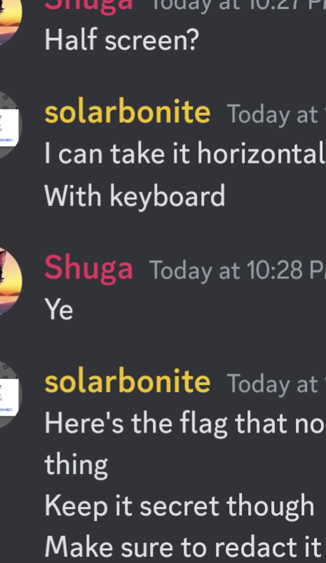
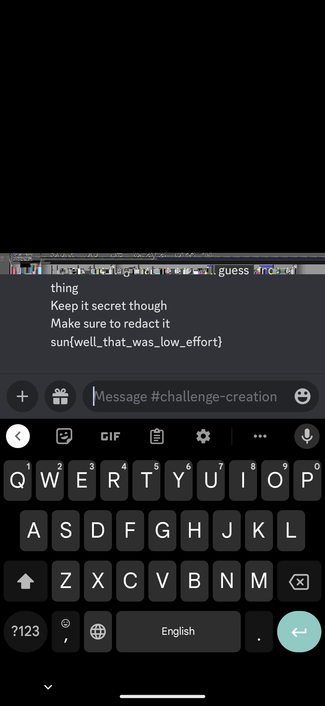

# SunshineCTF 2023

## Low Effort Wav 🌊

> Low-effort Wav
> Last year we went all-out and created a JXL file that had too much data.
> 
> That was too much effort. Shuga had to go and create a custom file that was altered, that's too much work, and is too passé. Also an astounding 286 guesses were made against 9 correct answers. That was too many.
> 
> This year, we used an already existing vulnerability (edit: aaaaaaaaaand it's patched, and like a day after we made this challenge... which was months ago), for minimum effort. And the flag, dude, is like, fully there, when you find it. Not half there. No risk of guessing.
> 
> This year, we introduce:
> 
> The low-effort wave 🌊
> Ride the wave man. 🏄‍♂️🏄‍♀️🌊
> 
> The wave is life. The waves are like, sound, and like water, and like cool and refreshing dude.
> 
> But waves are hard to ride
So listen to them instead, crashing on the seashore. Listen to the music of the sea. Like the theme this year is music or something. So I theme this challenge, like, minimum effort music. Listen to this attached .wav file. It's amazing. Or so I've heard. Or rather, haven't. Something's broken with it. I don't know dude.
> 
> It also doesn't work. Can you fix this for me? I think there's a flag if you can find it.
> 
> Hints
> There will be no hints given for this challenge by judges. The flag is in standard sun{} format. If anything, we've already given you too much data.
> 
>  Author: N/A
>
> [`low_effort.wav`](low_effort.wav)

Tags: _forensics_

## Solution
This challenge gives us a `wav` file. After running the `file` command on the file it becomes clear, the file is not an audio file but a `png`.

```
$ file low_effort.wav
low_effort.wav: PNG image data, 465 x 803, 8-bit/color RGBA, non-interlaced.
```

So lets have a look at it. The file seems to be cropped quite heavily. This looks like [`ACropalypse`](https://en.wikipedia.org/wiki/ACropalypse). 



We can use [`acropalypse.app`](https://acropalypse.app/) to recover the file for various smartphone models (or custom resolution). From the metadata (using exiftool) we can see the smartphone model is `Google Pixel 7`.



Flag `sun{well_that_was_low_effort}`