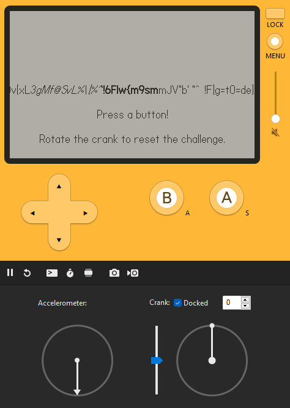

# SunshineCTF 2023

## First Date

> I'm Excited, this is my first date in years but this time it's a Play Date!
> 
> Sadly I'm locked out of it so if you could help me get in that would be great!
>
>  Author: N/A
>
> [`first_date.pdx.zip`](first_date.pdx.zip)

Tags: _rev_

## Solution
For this challenge we get a zip archive with two files in it. One is `pdxinfo` and the other is called `main.pdz`. The `file` tool doesn't recognize either, so we have to do some research. In `pdxinfo` we find two lines:

```bash
pdxversion=20000
buildtime=750024110
```

Also `main.pdz` starts with `Playdate PDZ`. A quick google reveals that the file seems to be a file container for a [`Playdate`](https://play.date/) application. Playdate is a `tiny handheld game system` that can be ordered as hardware, but also a SDK for development is offered. Lets run the *game* in the emulator and see what's this all about.



Cool, there's some rapidly moving text some instructions. We can enter a code by pressing `A`, `B` or the `directional buttons`. If we do so, a number sequence appears. Nothing happens, so we continue with our inspection. In the log the application gives us another information.

```bash
Figure out my code and I'll give you a flag!
Turn the crank to reset the pin. 
23:15:41: Loading: OK
```

All right, we have to find the correct number sequence. Since we don't want to guess the sequence (and this is a reversing challenge) we have to understand how the program internals are working.

We can find some information about the `pdz` format [`here`](https://github.com/cranksters/playdate-reverse-engineering/blob/main/formats/pdz.md). The format is simple. The header contains a 12 byte identifier (`Playdate PDZ`) and 4 bytes that contain flags. The only flag that is possible tells us if the container contains encrypted data. The flag is not set in our case, so no encryption.

After the header a list of files is stored. Every file starts with a file entry header.

```bash
uint8   Entry Flags
uint24  Entry Data Length
string  Null Terminated Filename 
```

The header is 4 byte aligned so there might be some padding bytes. After that comes the file data (zlib compressed if flag `0x80` is set) starting with 4 bytes that tell us the uncompressed data length. In the flag field also the entry type is stored. This can by `static images`, `animated images`, `video`, `audio`, `text strings`, `font` or `compiled Lua bytecode`. In our case the container contains three file entrys, all compiled Lua bytecode:

```bash
CoreLibs/string
CoreLibs/graphics
main
```

Extracting those files is easy enough (per script, binwalk, or just manually from a hexeditor like i did). After decompression we have three files containing Lua bytecode. The `file` command is even nice enough to tell us that the Lua version is `5.4`, pretty new. 

```bash
$ file main.luac
main.luac: Lua bytecode, version 5.4
```

To get more information we have to decompile the bytecode. There are a lot of decompilers [`luadec`](https://github.com/viruscamp/luadec), [`unluac`](https://sourceforge.net/projects/unluac/), [`RustyLuaDec`](https://github.com/dondish/RustyLuaDec) or some [`online decompilers`](https://luadec.metaworm.site/), [`like this`](https://Lua-bytecode.github.io/). But many don't support new Lua versions and none of them worked even if Lua 5.4 was supported.

In this case we have to do the work on our own. The plan is to get Lua 5.4 and use `luac -l` to dump the dissasembly. With this we can reconstruct the Lua code ourself. Lets do this!

We can get all released Lua versions from [`here`](http://www.Lua.org/ftp/).

```bash
curl -R -O http://www.lua.org/ftp/lua-5.4.6.tar.gz
tar zxf lua-5.4.6.tar.gz
cd lua-5.4.6
make all test
```

After successfully building we can start disassembling the bytecode.

```bash
$ ./luac -l first_date.pdx/main.luac
./luac: first_date.pdx/main.luac: bad binary format (lua_Integer size mismatch)
```

What?? The file can't be read. So we have to troubleshoot a bit. Lets see where Lua throws this message at us:

```c
static void checkHeader (LoadState *S) {
  /* skip 1st char (already read and checked) */
  checkliteral(S, &LUA_SIGNATURE[1], "not a binary chunk");
  if (loadByte(S) != LUAC_VERSION)
    error(S, "version mismatch");
  if (loadByte(S) != LUAC_FORMAT)
    error(S, "format mismatch");
  checkliteral(S, LUAC_DATA, "corrupted chunk");
  checksize(S, Instruction);
  checksize(S, lua_Integer);
  checksize(S, lua_Number);
  if (loadInteger(S) != LUAC_INT)
    error(S, "integer format mismatch");
  if (loadNumber(S) != LUAC_NUM)
    error(S, "float format mismatch");
}
```

All right, Lua is checking the header. We open a hexeditor on the side to check all the fields manually.

```
Offset(h) 00 01 02 03 04 05 06 07 08 09 0A 0B 0C 0D 0E 0F

00000000  1B 4C 75 61 54 00 19 93 0D 0A 1A 0A 04 04 04 78  .LuaT..“.......x
00000010  56 00 00 00 40 B9 43 01 8A 40 6D 61 69 6E 2E 6C  V...@¹C.Š@main.l
```

The signature is fine `\x1bLua` and also the version field matches `major version 5, minor version 4`. The next check tests for the byte sequence `\x19\x93\r\n\x1a\n` and also seems fine. After this some data-type sizes are checked. We have

```bash
Instruction     4 byte
lua_Integer     4 byte
lua_Number      4 byte
```

And here the error is thrown, since our build uses 64 bit integers (so 8 bytes) and no 32 bit integers. Soooo, we need to rebuild with the correct integer size. The data types are defined in `luaconf.h` and luckily there is this line we can change to build with the correct integer size.

```c
/*
@@ LUA_32BITS enables lua with 32-bit integers and 32-bit floats.
*/
#define LUA_32BITS	1
```

Perfect, now we just have to rebuild and then we finally can get our disassembly.

```bash
$ ./luac -l first_date.pdx/main.luac

main <main.lua:0,0> (54 instructions at 0x55df3152bc90)
0+ params, 8 slots, 1 upvalue, 1 local, 36 constants, 6 functions
        1       [1]     CLOSURE         0 0     ; 0x55df3152c780
        2       [1]     GETUPVAL        0 0     ; _ENV
        3       [1]     LOADK           1 1     ; "CoreLibs/graphics"
        4       [1]     TEST            0 0
        5       [3]     GETUPVAL        0 0     ; _ENV
        6       [3]     LOADK           1 3     ; "Figure out my code and I'll give you a flag!"
        7       [3]     TEST            0 0
        8       [4]     GETUPVAL        0 0     ; _ENV
        9       [4]     LOADK           1 4     ; "Turn the crank to reset the pin. "
        10      [4]     TEST            0 0
        11      [6]     GETUPVAL        0 0     ; _ENV
...

        21      [77]    GETUPVAL        4 1     ; _ENV
        22      [77]    GETTABLE        4 4 9
        23      [77]    GETUPVAL        5 1     ; _ENV
Segmentation fault
```

It segfaulted? Maybe we are using the wrong release? At this point I tried all 4.5.x releases, but the result was always the same. Taking a step back, and reading some more documentation about `Playdate`, we can find a good information on this [`site`](https://github.com/cranksters/playdate-reverse-engineering/blob/main/formats/luac.md).

> To maintain backwards-compatibility with Lua 5.4-beta bytecode from pre-release versions of the Playdate SDK, additional Lua 5.4.3 opcodes were appended to the opcode map like so:

Ah, Playdate uses a customized Lua version that is based on Lua 5.4.3 with some custom bytecodes. That makes sense. And even better, on the overview page there is a link to [`this`](https://github.com/scratchminer/lua54) fork of lua that `aims to match the custom tweaks that Panic added for Playdate-flavoured Lua`. Perfect, so we grab this version, build it and try to dump the disassembly another time, and this time, it works [`like magic`](main_disasm.txt).

Now we can start manual decompilation. I used [`Lua Bytecode Explorer`](https://www.luac.nl/s/14fbea26ac382adff23862142a) to validate if the generated bytecode is the same of my Lua code and went line by line recreating the [`Lua source`](main_disasm.txt) from the disassembly.

```lua
main <main.lua:0,0> (54 instructions at 0x55e297fecc80)
0+ params, 8 slots, 1 upvalue, 1 local, 36 constants, 6 functions
	1	[1]	VARARGPREP	0
	2	[1]	GETTABUP 	0 0 0	; _ENV "import"
	3	[1]	LOADK    	1 1	; "CoreLibs/graphics"
	4	[1]	CALL     	0 2 1	; 1 in 0 out
	-- print("Figure out my code and I'll give you a flag!")
	5	[3]	GETTABUP 	0 0 2	; _ENV "print"
	6	[3]	LOADK    	1 3	; "Figure out my code and I'll give you a flag!"
	7	[3]	CALL     	0 2 1	; 1 in 0 out
	-- print("Turn the crank to reset the pin. ")
	8	[4]	GETTABUP 	0 0 2	; _ENV "print"
	9	[4]	LOADK    	1 4	; "Turn the crank to reset the pin. "
	10	[4]	CALL     	0 2 1	; 1 in 0 out
	-- playdate.display.setRefreshRate(50)
	11	[6]	GETTABUP 	0 0 5	; _ENV "playdate"
	12	[6]	GETFIELD 	0 0 6	; "graphics"
	13	[7]	GETTABUP 	1 0 5	; _ENV "playdate"
	14	[7]	GETFIELD 	1 1 7	; "display"
	15	[7]	GETFIELD 	1 1 8	; "setRefreshRate"
	16	[7]	LOADI    	2 50
	17	[7]	CALL     	1 2 1	; 1 in 0 out
	-- playdate.setBackgroundColor(---)
	18	[9]	GETFIELD 	1 0 9	; "setBackgroundColor"
	19	[9]	GETFIELD 	2 0 10	; "kColorWhite"
	20	[9]	CALL     	1 2 1	; 1 in 0 out
	
	-- _ENV["generateFlag"] = generateFlag
	-- _ENV["makeTextDisplayable"] = makeTextDisplayable
	21	[17]	CLOSURE  	1 0	; 0x55e297fed770
	22	[11]	SETTABUP 	0 11 1	; _ENV "generateFlag"
	23	[32]	CLOSURE  	1 1	; 0x55e297feda20
	24	[19]	SETTABUP 	0 12 1	; _ENV "makeTextDisplayable"
	-- _ENV["noiseSeed"] = 1234567
	-- math.randomseed(noiseSeed)

    ...
```

At the beginning some global variables are initialized with some values and function pointers. There is a interesting looking function called `generateFlag` and a random seed constant that could come in handy later.

After I went through the whole disassembly this is what produced pretty much 100% the compiled bytecode (mind, I left out some functions that where not of interest):

```lua
print("Figure out my code and I'll give you a flag!")
print("Turn the crank to reset the pin. ")
playdate.display.setRefreshRate(50)
playdate.setBackgroundColor(---)
_ENV["generateFlag"] = generateFlag
_ENV["makeTextDisplayable"] = makeTextDisplayable
_ENV["noiseSeed"] = 1234567
math.randomseed(noiseSeed)
_ENV["pressedButtons"] = ""
_ENV["counter"] = 0
_ENV["buttons"] = {"left", "right", "up", "down", "A", "B"}
_ENV["generateOrder"] = generateOrder
_ENV["playdate"]["cranked"] = cranked
_ENV["clean"] = clean
_ENV["index"] = ""
_ENV["lastPressed"] = "Press a button!"
_ENV["playdate"]["update"] = update

function generateFlag()
  local flag = ""
  for i = 1,64 do
    flag = flag .. string.char(math.random(32, 126))
  end
  return flag
end

function makeTextDisplayable()
-- ...
end

function generateOrder()
 local x = ""
  for i=1,20 do
    x = x .. i
  end
  return x
end

function cranked()
-- ...
end

function clean(value)
  local var1 = ""
  for i = 1, #value, 2 do
    local c = value:sub(i, i+1)
    local n = tonumber(c) % 26 + 65
    var1 = var1 .. string.char(n)
  end
  return var1
end

function update()
  _ENV["counter"] = _ENV["counter"] + 1
  drawTextAligned(generateFlag(), 200, 120, kTextAlignment.center)
  
  for i=1,#_ENV["buttons"] do
    if _ENV["playdate"]["buttonJustPressed"](_ENV["buttons"][i]) then
     _ENV["pressedButtons"] = _ENV["pressedButtons"] .. i
     _ENV["lastPressed"] = _ENV["buttons"][i]
    end
  end
  
  drawTextAligned(lastPressed, 200, 160, kTextAlignment.center)
  drawTextAligned(makeTextDisplayable(pressedButtons), 200, 180, kTextAlignment.center)
  drawTextAligned("Rotate the crank to reset the challenge.", 200, 200, kTextAlignment.center)
   
  if _ENV["pressedButtons"] == generateOrder() then
    print("Pin entered correctly!")
    setFont(font.kVariantBold)
    _ENV["cleaned"] = clean(pressedButtons)
    print("Flag: sun{" .. _ENV["cleaned"] .. "}")
    drawTextAligned("Flag: \nsun{" .. _ENV["cleaned"] .. "}", 200, 80, kTextAlignment.center)
  end
end
```

We can see that Playdate gets two functions hooked in, one is `cranked` (if the crank is turned) which resets the challenge (as the program told us earier). The other is `update` which is called every frame and does all the visual outputs.

So lest generate the flag, right?
```lua
$ cat gen_flag.lua
function generateFlag()
  local flag = ""
  for i = 1,64 do
    flag = flag .. string.char(math.random(32, 126))
  end
  return flag
end

math.randomseed(1234567)
print(generateFlag())
```

```bash
$ ./lua54-5.4.0/lua gen_flag.lua
2WWb63|H "A uUR_Se{ 'FBM/4SDNAG!mh&fC{xK-y~|nG8w4<~s#g!3tW!Y5P##
```

But.. no, the flag is not accepted. This function seems to be a red herring and is just used to generate fancy output for display purpose. Well, so we continue reading the code.

The update function first prints the moving flag string and then captures user input to generate the sequence.

```lua
_ENV["counter"] = _ENV["counter"] + 1
drawTextAligned(generateFlag(), 200, 120, kTextAlignment.center)

for i=1,#_ENV["buttons"] do
    if _ENV["playdate"]["buttonJustPressed"](_ENV["buttons"][i]) then
     _ENV["pressedButtons"] = _ENV["pressedButtons"] .. i
     _ENV["lastPressed"] = _ENV["buttons"][i]
    end
  end
```

After this some more infos are printed to screen and then there's this interesting piece that checks if our button sequence equals the sequence which `generateOrder` returns. If this is the case the flag is printed.

```lua
if _ENV["pressedButtons"] == generateOrder() then
    print("Pin entered correctly!")
    setFont(font.kVariantBold)
    _ENV["cleaned"] = clean(pressedButtons)
    print("Flag: sun{" .. _ENV["cleaned"] .. "}")
    drawTextAligned("Flag: \nsun{" .. _ENV["cleaned"] .. "}", 200, 80, kTextAlignment.center)
  end
```

So the plan now is to check the correct sequence, go back to the Playdate simulator and enter the sequence, get the flag and win!

```lua
function generateOrder()
 local x = ""
  for i=1,20 do
    x = x .. i
  end
  return x
end
```

This returns `1234567891011121314151617181920`, so we have to map this to the buttons. We have a dictionary with 6 buttons `_ENV["buttons"] = {"left", "right", "up", "down", "A", "B"}` if we want to map we have a little issue, there are indice which cannot be mapped to a button within this dictionary. So we can keep the simulator closed, there's no way we can input the correct sequence.

Well, lets go back to the code, we have to recreate the flag on our own.

```lua
 _ENV["cleaned"] = clean(pressedButtons)
print("Flag: sun{" .. _ENV["cleaned"] .. "}")
```

We can see that the flag is surrounded with `sun{}` and between the braces the content of `cleaned` is printed. The global variable `cleaned` is assigned with the result of the function `clean` that takes the button sequence as parameter. Since we know the sequence is assumed to be `1234567891011121314151617181920` we can just pass in this value.

```lua
function clean(value)
  local var1 = ""
  for i = 1, #value, 2 do
    local c = value:sub(i, i+1)
    local n = tonumber(c) % 26 + 65
    var1 = var1 .. string.char(n)
  end
  return var1
end
```

Lets update our old `gen_flag.lua` script and let it generate the flag.

```bash
$ lua gen_flag.lua
sun{MIEANBLVFPZJTDOA}
```

Looks strange... Did we make a mistake somewhere on that long road? But no... The flag is accepted and we win! 

Flag `sun{MIEANBLVFPZJTDOA}`