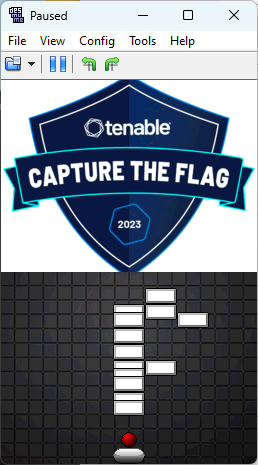
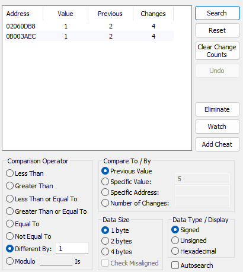
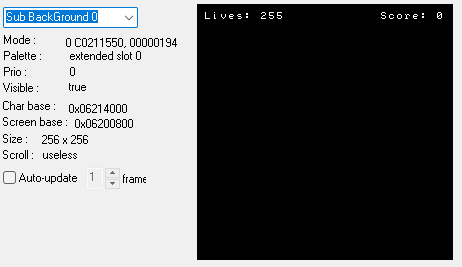
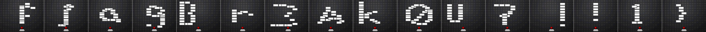

# Tenable Capture the Flag 2023

## Brick Breaker

> Stole some resources from public domain and made a brick breaker clone. Collision detection is bad and it's pretty hard, but see if you can find the hidden message!
>
> [`ctf.nds`](ctf.nds)

Tags: _rev_

## Solution

Disclaimer: I didn't finish this challenge in the CTF but picked it up again in aftermath.

For this challenge a `nds` file is given. When running through `file` we are told the file is an `Nintendo DS ROM image`.

```bash
$ file ctf.nds
ctf.nds: Nintendo DS Slot-2 ROM image (PassMe)
```

For `DS` reversing there are quite a few [`tools`](https://www.nogba.com/no$gba-download.htm) and [`resources`](https://problemkaputt.de/gbatek.htm) [`available`](https://www.starcubelabs.com/reverse-engineering-ds/).

For this challenge I use [`DeSmuME`](http://desmume.org/) as this emulator capability to nice and easy inspect memory activity. After opening the ROM we can play a game of `Brick Breaker`. Looking at the first level it is pretty obvious the flag is spelled out level by level one character each and starting with an `f`.



The problem only is, the game is hard and gives us only 5 tries. To cope with this we can search the memory location where `lives` are stored and change this to something large.

DeSmuME offers a nice memory search functionality. First, after the game started, do a pass for all bytes with value `5`. The storage size is a good guess and the value we know since it's displayed in one of the background layer images and after 5 tries the game resets.

After loosing one live we do another scan. This time for `comparison operator: difference by 1` and `compare by: previous value`. This procedure is repeated until the list of potential candidates is small enough for further inspection.



Here only two addresses are left. Jumping to the memory locations we can observe what value decreases by one after each lost ball. Also setting the value to something else should reflect in the background layer rendering.

```
3C 00 00 00 00 00 00 00 FF 00 02 00 F0 00 00 
                        ^^
                        offset 02060DB8
```



So, we have enough lives now and can just play all the levels to get the flag. It starts well, we get `f`, `l`, `a` and `g` but then the game jumped back to the first level again. Sad... This is where I ran out of time, I did a bit of inspection but to no good result. 

Another day and a bit of input from the community. I played the game and observed the memory location where `lives` are stored. Very close by a number increased every time a level was finished by one, this looks suspiciously like a `next level` value. 

```
3C 00 00 00 00 00 00 00 FF 00 03 00 F0 00 00 
|
v
3C 00 00 00 00 00 00 00 FF 00 04 00 F0 00 00 
|
v
3C 00 00 00 00 00 00 00 FF 00 05 00 F0 00 00 
                              ^
                              next level is reset to 1 after reaching 5
```

Setting the value to `6` (so it jumps over level 5 which the game resets to the first level) and it works, we end up in level `6` and can play the whole rest of the game...

```
3C 00 00 00 00 00 00 00 FF 00 06 00 F0 00 00 
                              ^
                              manually jump over level 5
```

...and fetching the [`flag`](images/levels.png)



Flag `flag{Br3Ak0U7!!1}`