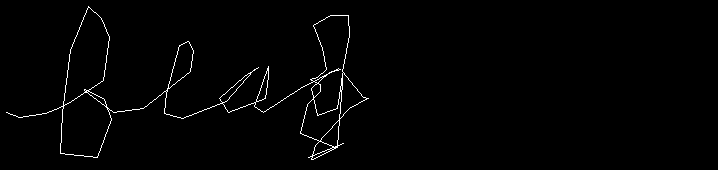
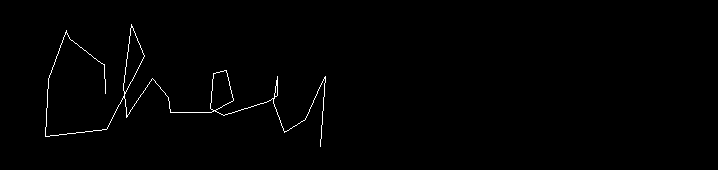
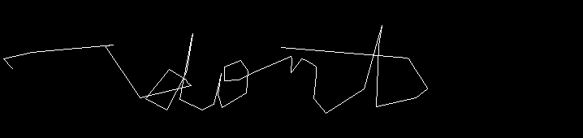
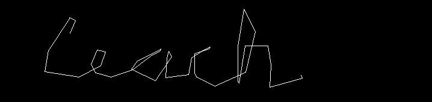
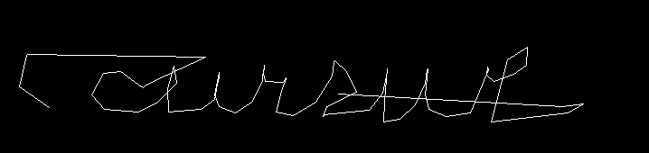
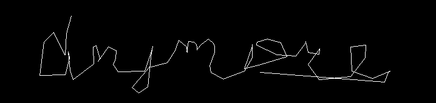

# Tenable Capture the Flag 2023

## Ancient Scrawls

> My friends and I kept getting caught passing notes in computer class, so we came up with a different way to communicate.
>
>  Author: N/A
>
> [`ancient_scrawls.gif`](ancient_scrawls.gif)

Tags: _stego_

## Solution
For this challenge a `Gif` is given. After opening we can see a mouse cursor move over the image. Looking closely one can see that the cursor is writing letters, so the flag might be reconstructible if the mouse position is traced.

Doing this by hand (or video editing tool) is tedious so we write a quick script to extract the words. Some things where to consider: Words where overlapping, so just tracking the mouse cursor and drawing lines between points will result in a mess of lines. Therefore I tried to detect word boundaries by checking cursor move distance and direction. 

The mouse position can easily be detected, since the background is white we just search the first non-white pixel to get the position.

```python
from PIL import Image, ImageDraw
from PIL import GifImagePlugin
import math

def get_position(img):
    data = img.load()
    for y in range(1, img.height):
        for x in range(1, img.width):
            r, g, b = data[x,y]
            if r < 0.1:
                return (x,y)
    return (-1,-1)

def dist(p0, p1):
    dx = p0[0] - p1[0]
    dy = p0[1] - p1[1]
    return math.sqrt(dx*dx+dy*dy)

prev = (0,0)
reset = False
index = 0
with Image.open("ancient_scrawls.gif") as image:
    out = Image.new(mode="RGB", size=(image.width, image.height))
    out1 = ImageDraw.Draw(out)
    for frame in range(0, image.n_frames):
        if reset:
            out = Image.new(mode="RGB", size=(image.width, image.height))
            out1 = ImageDraw.Draw(out)
            reset = False

        image.seek(frame)
        frame_img = image.convert("RGB")
        pos = get_position(frame_img)

        if prev != (-1,-1) and pos != (-1, -1):
            out1.line([prev, pos])

        if (dist(pos,prev) > 80 and prev[0] > pos[0]):
            out.save("out_" + str(frame) + ".png")
            index = index + 1
            reset = True
        prev = pos
```

This will generate a sequence of files with some words in it.

      

It was a hard time to decipher this "handwriting", but in the end the sequence of `flag{`, `they`, `dont`, `teach`, `cursive`, `anymore`, `}` formed the flag 

Flag `flag{they_dont_teach_cursive_anymore}`