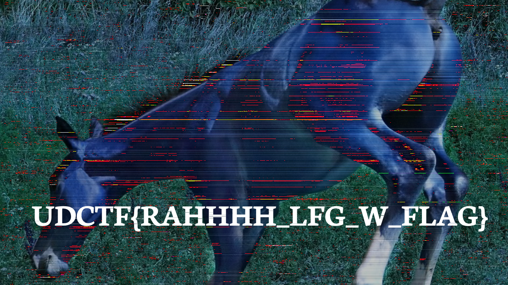

# UDCTF 2023

## Bussin

> Bought a friggin domain: https://boiformat.org/
>
>  Author: ProfNinja
>

Tags: _rev_

## Solution
We get a link for this challenge where we can get a pdf describing a modified version of [`The Quite Ok Image Format`](boyformat.pdf). At the top we find a route that gives us a [`boi image`](flag.boi) and then there are some augmentations. Mainly the renaming of `QOI` to `BOI` but also the magic bytes changed, some hash calculation changed and most notably the index chunk consumed two bytes rather than one byte as in the original format and the running array was increased from `64` to `69` elements.

The solution of course is to write an decoder, or rather use an [`existing decoder`](https://github.com/phoboslab/qoi/blob/master/qoi.h) and add the modifications.

After adding the modifications and converting to `png` the image (although having some artifacts) is recognizeable and gives us the flag.

Flag `UDCTF{RAHHHH_LFG_W_FLAG}`