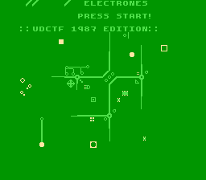
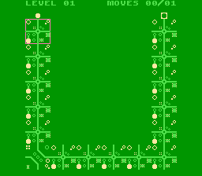

# UDCTF 2023

## ElectroNES

> Just wanted to make an NES game with a level loader in 6502. Works like this: Your job is to get the electrons to flow from the correct source to the correct sink (circle to circle, triangle to triangle, etc). You can highlight one circuit square at a time and swap it from it's original state to a different state. You only get N moves per level (top right corner), hit start when you think the puzzle is solved and the electrons will flow. This is a rev problem not misc... We built this in an NES game jam.
> 
> (If you want to play more interesting puzzle levels you can grab a non-flag version at https://prof.ninja/electrones/roms/electro.nes)
>
>  Author: ProfNinja
>
> [`udctf.nes`](udctf.nes)

Tags: _rev_

## Solution
For this challenge we get a rom for `Nintendo Entertainment System (NES)`. After loading the rom into an [`emulator`](https://fceux.com/web/home.html) we see it's a puzzle game where the player has to adjust circuit boards to let electrons flow from a start position to the intended target.

 

After pressing start the first level is loaded, we have one possible move we can do (one change of the board) and then let the electron move along the circuit until reaching its target.

After playing a few levels we can observer that the level layout are actually characters, starting with `U` in the first level, `D` in the second and so on. After level 6 the game tells us that there are 17 more levels we have to unlock somehow.

At this point we have the start of the flag, so nothing new really. Next we have to see how we can unlock the levels, jump to single levels or whatever would help us to get the flag.

The `6502` code is not extremely extensive, but still, without comments or structure its a tedious task to go through. So we check one thing first, where the game does store its variables. For this the emulator has a nice option that scans the RAM for specified values. After this we can do a rescan for the previously found values with certain logic, for instance what of those values increased by one. With this we can find thee location where the current level index is stored. Some of the potentiall useful variables are:

```bash
$001C => max moves
$001D => num moves
$001E => current level
```

Thats nice, we can give us as many moves as we like, but it doesn't help at this moment, since all levels are solveable. We can also change the current level index, but I didn't manage to get it working. After the start screen the first level was always loaded and the game hang when loading the next level but the `$001E` was rewritten. 

The next thing I tried was to see where the level data was loaded into ram. 

``` 
000000 00 00 00 00 FF FF FF FF 00 00 00 00 FF FF FF FF 
000010 FF FF C3 C9 23 24 84 20 2A 4A 3A 00 01 00 01 00 
000020 00 00 01 00 00 00 00 01 EF 01 00 FF 00 FF FF FF 
000030 00 00 00 00 FF 00 03 03 03 03 00 00 03 03 03 03 
000040 00 00 03 03 03 03 00 00 03 03 03 03 00 00 03 03 
000050 03 03 00 01 00 00 00 00 00 00 03 03 03 03 00 00 
000060 03 03 03 03 00 00 03 03 03 03 00 00 03 03 03 03 
000070 00 00 03 03 03 03 00 01 00 00 00 00 00 FF 00 00 
000080 00 00 88 00 00 90 FF 00 98 05 FF 01 FF FF 00 FF 
000090 FF 00 FF FF 00 FF 00 00 00 00 88 00 00 90 FF 00
0000A0 98 06 00 00 02 00 0A AD 6A 00 00 00 FF FF FF FF
```

We can see that the level data is loaded starting `$0059` in the zero page. We can observe that, if we change tiles on the board the value changes at certain spots. The board layout is linear in memory starting with the top-left tile. Each tile can have values from 0-3 where value 0, 1 and 2 are the three circuit tile types and value 3 is an empty tile. We can change tiles as we wish, or write nonsense values and see what happens. But thats no use to get the flag.

The levels have to be stored somewhere on the rom though. And when a level is loaded, the content is loaded to the zero page location. The hope now is, that the level structure is the same before loading and not obfuscated or encrypted (but we are at NES here, every cycle counds, right?). Scrolling through the ram we can see that our code starts at offset `$8000` that is quite common due to [`NES memory mapping`](https://github.com/solidajenjo/NES-Emulator/blob/master/DragoNES/DragoNES/docs/nesmemorymapping.txt). A bit further down we find some values that look very much like level structure (a lot of bytes with value `03`). Now we check the exact match to the first level and, luck us, find the levels are stored with the exact same linear layout starting at address `$27e0`. Moving on we find each level takes `57` bytes, so we can create a list of offsets for each level:

```bash
level 1 - $27e0
level 2 - $2819
level 3 - $2852
...
```

Verifying this for the first couple of levels looks promising. So we can write a small script to extract the level information and print it to screen.

```python
import sys

offset = 0x27e0
data = open("udctf.nes", "rb").read()

for lvl in range(0,37):
    foo = data[offset:offset+36]
    offset += 57
    for i in range(len(foo)):
        x = "X" if foo[i] != 3 else " "
        print(x, end="")
        if (i+1)%6 == 0: print("")

    print("")
```

Running this, will finally give us the flag.

```bash
X    X
X    X
X    X
X    X
X    X
XXXXXX

XXXXXX
 X   X
 X   X
 X   X
 X   X
XXXXXX

 XXXXX
 X
 X
 X
 X
 XXXXX

XXXXXX
  X
  X
  X
  X
  X

  XXXX
  X
  X
XXXXXX
  X
  X

   XXX
   X
  XX
  XX
   X
   XXX

XX   X
XXX  X
X X  X
X XX X
X  XXX
X   XX

 XXXXX
 X   X
XXXXXX
 X
 X
 XXXXX

XXXXXX
X
XXXXXX
     X
     X
XXXXXX
```

Flag `UDCTF{NeS_FLAg_OH_SNAP}`