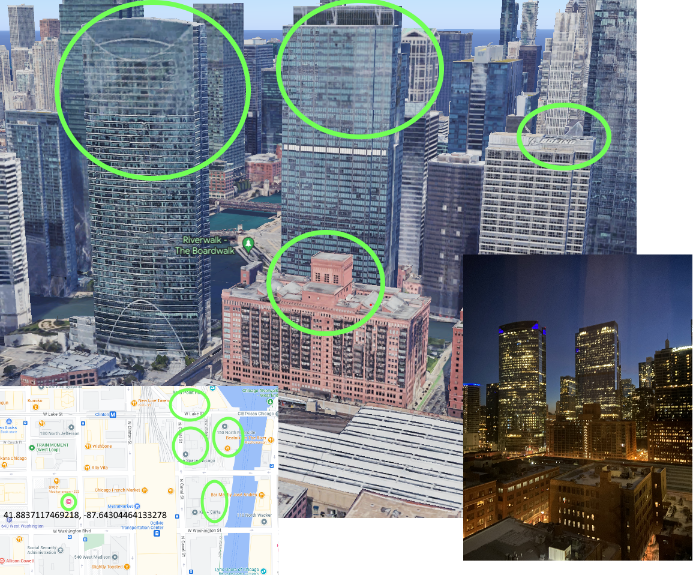

# UIUCTF 2023

## Finding Jonah?

> Jonah Explorer, world renowned, recently landed in the city of Chicago, so you fly there to try and catch him. He was spotted at a joyful Italian restaurant in West Loop. You miss him narrowly but find out that he uses a well known social network and and loves documenting his travels and reviewing his food. Find his online profile.
>
>  Author: N/A
>
> [`chicago.jpeg`](chicago.jpeg)

Tags: _osint_

## Solution
For this challenge there is a picture Jonah apparently shot from his hotel room.

Google reverse search didn't bring good results, so I opened Google Earth and browsed the city for this certain view. Mostly searching for the tower on the left due to his relatively iconic top. Also there is a logo on the right side that vaguely looks like the `Boeing Logo`.

And on the location `41.883725180464275, -87.64299051030042` can the [`Hampton Inn Chicago Downtown West Loop`](https://goo.gl/maps/iH5f1E6fh3dEv2Ez8) be found.

Flag `uiuctf{hampton_inn}`