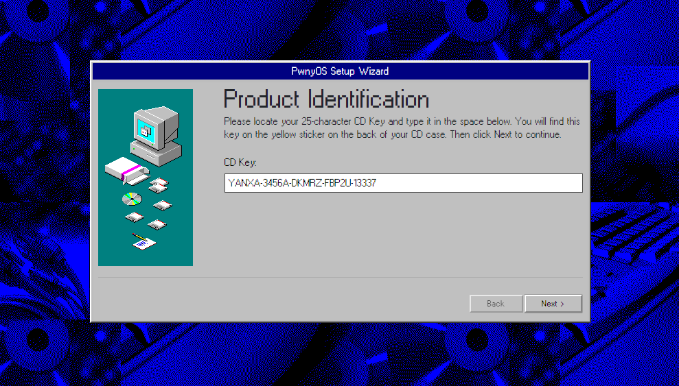

# UIUCTF 2023

## pwnykey

> Can you obtain a valid pwnyOS activation key?
>
>  Author: arxenix
>
> [`handout.tar`](handout.tar)

Tags: _rev_

### Disclaimer
For transparency, I didn't solve this challenge during the event but in aftermath.

## Solution
For this challenge a link to a website, the `pwnyOS activation` form, is given. Also the code for the service is provided. The servic ecode is fairly small and beatifully themed in a `Windows95` style. 

At it's heart the service uses Flask to deliver content. There are two endpoints, the root `/` delivers the index page. The second endpoint is `/check` which can be called with `POST` or `GET` verb. `GET` is only workable from localhost and otherwise delivers a 403 error. With `POST` a key can be send, the key is checked for valid format and is then assigned to `key_to_check`. After this is done a new process is started and if the result of this process is successfully the flag is printed.

```python
#!/usr/bin/env python3
from flask import Flask, request
import threading
import subprocess
import re

app = Flask(__name__)
FLAG = open('flag.txt').read()
lock = threading.Lock()

@app.route('/')
def index():
    return app.send_static_file('index.html')

key_to_check = "00000-00000-00000-00000-00000"
key_format = re.compile(r'^[0-9A-Z]{5}-[0-9A-Z]{5}-[0-9A-Z]{5}-[0-9A-Z]{5}-[0-9A-Z]{5}$')
@app.route('/check', methods=['GET', 'POST'])
def check():
    global key_to_check
    if request.method == 'GET':
        if request.remote_addr != '127.0.0.1':
            return "Forbidden", 403
        try:
            lock.release()
        except:
            pass
        return key_to_check
    else:
        key = request.form['key']
        if not key_format.match(key):
            return "Invalid key format", 400
        lock.acquire()
        key_to_check = key
        process = subprocess.Popen(['./node_modules/@devicescript/cli/devicescript', 'run', '-t', 'keychecker.devs'], stdout=subprocess.PIPE)
        for line in iter(process.stdout.readline, b''):
            if b"success!" in line:
                process.terminate()
                return FLAG
        process.wait()
        return "Incorrect key", 400
```

The main logic obviously is handled by the process, so more inspection needs to be done here. The command executed is `./node_modules/@devicescript/cli/devicescript run -t keychecker.devs`. [`DeviceScript`](https://microsoft.github.io/devicescript/intro), as it turns out, is a language developed by Microsoft that *brings a TypeScript developer experience to low-resource microcontroller-based devices*. It's [`well documented`](https://microsoft.github.io/devicescript/language/bytecode) and also the [`source is accessible`](https://github.com/microsoft/devicescript).

The image which is run is in `keychecker.devs` which contains binary data. The data starts with `44 65 76 53 (DevS)` and `0A 6E 29 F1` magic bytes which indicate a compiled DeviceScript artifact. In the documentation [`a disassembler`](https://microsoft.github.io/devicescript/language/runtime#bytecode-example) is mentioned, this would be great to get insight.

```
C:\work\pwnykey>devs disasm keychecker.devs
using devs: v2.11.6, runtime: v2.11.6, node: v14.18.2 from C:\work\sdks\emsdk\node\14.18.2_64bit\bin\node_modules\@devicescript\cli\built
// img size 12416
// 14 globals

proc main_F0(): @1120
  locals: loc0,loc1,loc2
   0:     CALL prototype_F1()
???oops: Op-decode: can't find jump target 10; 0c
   7:     RETURN undefined
   9:     JMP 39
???oops: Op-decode: stack underflow; 4c
???oops: Op-decode: stack underflow; 250003
???oops: Op-decode: can't find jump target 22; 0c
  19:     RETURN undefined
???oops: Op-decode: can't find jump target 51; 0c
  23:     CALL ???oops op126(62, ret_val())
???oops: Op-decode: can't find jump target 34; 0c
  31:     RETURN undefined
???oops: Op-decode: can't find jump target 72; 0c
???oops: Op-decode: stack underflow; 02
???oops: Op-decode: stack underflow; 253303
???oops: Op-decode: can't find jump target 46; 0c
  43:     RETURN undefined
  45:     JMP 89

  ...

Strings ASCII:
   0: "start!"
   1: "fetch"
   2: "method"
   3: "GET"
   4: "headers"
   5: "Headers"
   6: "body"
   7: "tcp"
   8: "startsWith"
   9: "https://"
  10: "tls"
  11: "http://"
  12: "invalid url: {0}"
  13: "/"
  14: "includes"
  15: "@"
  16: "credentials in URL not supported: {0}"
  17: ":"
  18: "invalid port in url: {0}"
 
 ...
```

Sadly the disassembly result is messed up quite a lot. Inspecting the source code of the disassembler sheds light on the issue. In a first part opcodes are parsed and statements are gathered, especially a list of instructions is generated for the statement program counter offset, so statements can be easily looked ab for a certain program counter value.

```typescript
while (pc < bend) {
	try {
		stmtStart = pc
		jmpoff = NaN
		const op = decodeOp()
		const stmt = new OpStmt(op.opcode)
		stmt.pc = stmtStart
		stmt.pcEnd = pc
		stmt.intArg = op.intArg
		stmt.args = op.args
		if (opJumps(stmt.opcode)) {
			const trg = jmpoff + stmt.intArg
			if (!(0 <= trg && trg < bytecode.length)) {
				error(`invalid jmp target: ${jmpoff} + ${stmt.intArg}`)
			}
			stmt.intArg = trg
		}

		stmt.index = stmts.length
		stmts.push(stmt)
		byPc[stmt.pc] = stmt
	} catch (e) {
		if (throwOnError) {
			throw e
		} else {
			const stmt = new OpStmt(Op.STMT0_DEBUGGER)
			stmt.error = e.message
			if (stmtStart == pc) pc++
			stmt.pc = stmtStart
			stmt.pcEnd = pc
			stmts.push(stmt)
		}
	}
}
```

In the second pass the jump targets for jump instructions is resolved by going over all instructions, and for jump instructions, looking up the instruction at the target pc offset. This is where the error fires, since some of the jumps are not jumping to opcode boundary but in the middle of opcodes which results in a unknown jump target error. This is a [`obfuscation technique`](https://breakdev.org/x86-shellcode-obfuscation-part-3/) to complicate reverse engineering. The technique works in the runtime by letting the runtime skip certain bytes and continue the flow at a new offset.

```typescript
for (const stmt of stmts) {
	try {
		if (opJumps(stmt.opcode)) {
			const trg = byPc[stmt.intArg]
			if (!trg) error(`can't find jump target ${stmt.intArg}`)
			stmt.jmpTrg = trg
		}
	} catch (e) {
		if (throwOnError) throw e
		else stmt.error = e.message
	}
}
```

The skipped bytes are never executed, so, one thing that can be done is to find the jumps and replace all bytes with `nop` opcodes (along with the jump to reduce noise). This can be done by parsing the image opcodes, looking for jumps without jump target and replacing the bytes with `nops` and adjusting the program counter accordingly just like the runtime would have done. The full program for patching the image is available [`here`](patch_binary.cpp).

```c
for (;;)
{
	int opcode = bytecode[pc++];
	int jumpofs = -1, intArg = 0;
	if (op_takes_number(opcode))
	{
		jumpofs = pc - 1;
		intArg = decode_int(bytecode, pc);
	}

	// we are looking for unconditional forward jumps (plus actually test if the jump target exists or not)
	if (opcode == DEVS_STMTx_JMP)
	{
		int offset = intArg + jumpofs;
		assert(offset >= 0 || offset < length);

		if (offset >= pc) 
		{
			for (int i = jumpofs; i < offset; ++i) {
				bytecode[i] = 0;
			}
			pc = offset;
		}
	}

	if (op_is_stmt(opcode)) {
		break;
	}
}
```

After the jumps are patched away the image can be disassembled quite well. There is of course a bit of noise with the additional `nop` that can be removed, but afterwards the disassembly is [`very readable`](dump.asm). Here's a breakdown of the code.

```typescript
proc main_F0(): @1120
  locals: loc0,loc1,loc2
   0:     CALL prototype_F1()
   
  // fetch key from localhost
  10:     CALL ds."format"("start!")
  22:     CALL ds."print"(62, ret_val())
  34:     CALL fetch_F2("http://localhost/check")
  46:     CALL ret_val()."text"()
  57:     CALL ret_val()."trim"()
  68:     {G4} := ret_val()
  78:     CALL ds."format"("fetched key: {0}", {G4})
  92:     CALL ds."print"(62, ret_val())
```

The service starts with a nice `start!` message and fetches the product key at the `check` endpoint.

```typescript
// first condition, key length is 29 characters
 104:     JMP 143 IF NOT ({G4}."length" !== 29)			
 121:     CALL (new Error)("Invalid key")
 134:     THROW ret_val()
 143:     CALL {G4}."split"("-")
 157:     {G5} := ret_val()
 // key has 5 parts seperated by '-'
 167:     JMP 206 IF NOT ({G5}."length" !== 5)
 184:     CALL (new Error)("Invalid key")
 197:     THROW ret_val()
 // every key part is 5 characters long: XXXXX-XXXXX-XXXXX-XXXXX-XXXXX
 206:     CALL {G5}."some"(inline_F7)
 220:     JMP 254 IF NOT ret_val()
 232:     CALL (new Error)("Invalid key")
 245:     THROW ret_val()
 // every key part uses '0123456789ABCDFGHJKLMNPQRSTUWXYZ' alphabet
 254:     CALL {G5}."some"(CLOSURE(inline_F8))
 268:     JMP 302 IF NOT ret_val()
 280:     CALL (new Error)("Invalid key")
 293:     THROW ret_val()
 302:     CALL ds."format"("key format ok")
 314:     CALL ds."print"(62, ret_val())

 // ...

proc inline_F7(par0): @4916
   0:     RETURN (par0."length" !== 5)

proc inline_F8(par0): @4924
   0:     CALL par0."split"("")
  14:     CALL ret_val()."some"(inline_F14)
  27:     RETURN ret_val()

proc inline_F14(par0): @5292
   0:     CALL "0123456789ABCDFGHJKLMNPQRSTUWXYZ"."includes"(par0)
  14:     RETURN !ret_val()
```

Then the key format is checked. Keys are 29 characters long, subdivided in 5 character packets which are seperated by `-` and use a certain alphabet.

```typescript
// create index mapping for all the parts
 326:     CALL {G5}."map"(CLOSURE(inline_F9))
 340:     loc0 := ret_val()
 350:     {G6} := loc0[0]
 363:     {G7} := loc0[1]
 376:     {G8} := loc0[2]
 389:     {G9} := loc0[3]
 402:     {G10} := loc0[4]
 415:     CALL ds."format"("{0}", {G6})
 429:     loc0 := ret_val()
 439:     ALLOC_ARRAY initial_size=5
 448:     loc1 := ret_val()
 458:     loc1[0] := 30									; Y
 470:     loc1[1] := 10									; A
 482:     loc1[2] := 21									; N
 494:     loc1[3] := 29									; X
 506:     loc1[4] := 10									; A
 518:     CALL ds."format"("{0}", loc1)
 532:     JMP 569 IF NOT (loc0 !== ret_val())
 547:     CALL (new Error)("Invalid key")
 560:     THROW ret_val()
 569:     CALL ds."format"("passed check1")
 581:     CALL ds."print"(62, ret_val())

 // ...

proc inline_F9(par0): @4956
   0:     CALL par0."split"("")
  14:     CALL ret_val()."map"(inline_F15)
  27:     RETURN ret_val()

proc inline_F15(par0): @5312
   0:     CALL "0123456789ABCDFGHJKLMNPQRSTUWXYZ"."indexOf"(par0)
  14:     RETURN ret_val()
```

Next the first part of the key is tested. For this, for all parts, a mapping is created. Every character is mapped to the index of this character inside the alphabet. For instance

```
part 1				part 2			part3 
A  H  J  M  N 		Z  W  D  C  B   ...
|  |  |  |  |		|  |  |  |  |
10 16 17 20 21		31 28 13 12 11  ...
```

So in `{G6} - {G10}` are the index maps for the key parts. The validation test for the first part is trivial, it is checked against the indices 30, 10, 21, 29, 10 which can be mapped to the string `YANXA`.

```typescript
// concat second and third part to one array
 593:     CALL concat_F10({G7}, {G8})
 607:     {G11} := ret_val()
// sum over all indice is expected to be 134
 617:     CALL {G11}."reduce"(inline_F11, 0)
 632:     loc0 := (ret_val() !== 134)
 645:     JMP 687 IF NOT !loc0
// product over all indice is expected to be 12534912000
 659:     CALL {G11}."reduce"(inline_F12, 1)
 674:     loc0 := (ret_val() !== 12534912000)
 687:     JMP 722 IF NOT loc0
 700:     CALL (new Error)("Invalid key")
 713:     THROW ret_val()
 722:     CALL ds."format"("passed check2")
 734:     CALL ds."print"(62, ret_val())
```

Then the next two parts of the key are validated. For this both index maps are copied into one 10 item wide array. Then the sum and the product over the array are created. For a valid key the sum is assumed to be `134` and the product is assumed to be `12534912000`. To the next two parts a valid permutation needs to be found that fullfils both requirements. Bruteforcing this space is too slow but this can be tackled with a SAT solver (`z3` for instance). Another approach that works here, since there are many potential matching combinations in this problem space is to create random sets of potential combinations and doing this until one combination matches. Interestingly the second method, while somewhat counterintuitive finds results very quickly in a few seconds max. The whole code for the key generation part can be found [`here`](crack_key.cpp).

```c++
const char* part2()
{
    static char resultStr[12]{};

    std::random_device rd;
    std::mt19937 eng(rd());
    std::vector<int> buffer{};
    std::vector<int> values(31);

    std::iota(values.begin(), values.end(), 1);

    while (true)
    {
        buffer.clear();

		// uniformly sample values from alphabet index range
        std::sample(values.begin(), values.end(), std::back_inserter(buffer), 10, eng);

        uint64_t sum = 0, prod = 1;
        for (int i = 0; i < PART1_NUM_ELEMENTS; ++i)
        {
            sum += buffer[i];
            prod *= buffer[i];
        }

        if (sum == 134 && prod == 12534912000)
        {
            int i = 0;
            for (i = 0; i < PART1_NUM_ELEMENTS/2; ++i)
            {
                resultStr[i] = "0123456789ABCDFGHJKLMNPQRSTUWXYZ"[buffer[i]];
            }
            resultStr[i] = '-';
            for (; i < PART1_NUM_ELEMENTS; ++i)
            {
                resultStr[i + 1] = "0123456789ABCDFGHJKLMNPQRSTUWXYZ"[buffer[i]];
            }
            break;
        }
    }

    return resultStr;
}
```

Here'r some potential candidates for the second and third part

```
3456A-DKMRZ
3456A-GHKTZ
25689-CGMTZ
245AC-DGKRZ
34689-ADMYZ
2468C-DGKSZ
34689-ADMYZ
2569A-CDHYZ
```

The other, more analytical, posibility would be to use `z3` to solve this.

```python
from z3 import *

solver = Solver()

alphabet = "0123456789ABCDFGHJKLMNPQRSTUWXYZ"

x = [Int(f"x{i}") for i in range(10)]

solver.add(sum(x) == 134)
solver.add(Product(x) == 12534912000)

for i in range(10):
    solver.add(x[i] >= 0)
    solver.add(x[i] < len(alphabet))

solver.check()
model = solver.model()
result = ""
for i in range(10):
    result += alphabet[model[x[i]].as_long()]

print(result[:5]+"-"+result[5:])
```

```typescript
{G12} := {G9}
 757:     {G13} := 1337
 770:     loc2 := 0
 780:     JMP 832 IF NOT (loc2 < 420)
 798:     CALL nextInt_F13()
 808:     loc2 := (loc2 + 1)
 821:     JMP 780
 832:     ALLOC_ARRAY initial_size=3
 841:     loc0 := ret_val()
 851:     CALL nextInt_F13()
 861:     loc0[0] := ret_val()
 873:     CALL nextInt_F13()
 883:     loc0[1] := ret_val()
 895:     CALL nextInt_F13()
 905:     loc0[2] := ret_val()
 917:     CALL ds."format"("{0}", loc0)
 931:     loc0 := ret_val()
 941:     ALLOC_ARRAY initial_size=3
 950:     loc1 := ret_val()
 960:     loc1[0] := 2897974129
 973:     loc1[1] := -549922559
 990:     loc1[2] := -387684011
1007:     CALL ds."format"("{0}", loc1)
1021:     JMP 1058 IF NOT (loc0 !== ret_val())
1036:     CALL (new Error)("Invalid key")
1049:     THROW ret_val()
1058:     CALL ds."format"("passed check3")
1070:     CALL ds."print"(62, ret_val())
1082:     CALL ds."format"("success!")
1094:     CALL ds."print"(62, ret_val())
1106:     RETURN 0

// ...

proc nextInt_F13(): @5164
  locals: loc0
   0:     CALL {G12}."pop"()
  12:     loc0 := ret_val()
  22:     loc0 := (loc0 ^ ((loc0 >> 2) & 4294967295))
  41:     loc0 := (loc0 ^ ((loc0 << 1) & 4294967295))
  60:     loc0 := (loc0 ^ (({G12}[0] ^ ({G12}[0] << 4)) & 4294967295))
  86:     {G13} := (({G13} + 13371337) & 4294967295)
 106:     CALL {G12}."unshift"(loc0)
 120:     RETURN (loc0 + {G13})
```

The next part of the key uses a modified version of [`xorwow`](https://en.wikipedia.org/wiki/Xorshift#xorwow), a `shift-register generator` type of PRNG. The modification is mainly that the counter increment is changed from `362437` to `13371337`. The state is initialized with the fourth key part and the generator runs `420` times. After this the generator runs three times more and the result is assumed to be `2897974129`, `-549922559` and `-387684011`. To find a valid permutation we can just bruteforce the problem space as it's manageable big.

```c++
int xorwow(int ring[5], int& count, int& front)
{
    int back = (front + 1) % 5, value = ring[front];
    value = (value ^ ((value >> 2) & 0xFFFFFFFF));
    value = (value ^ ((value << 1) & 0xFFFFFFFF));
    value = (value ^ ((ring[back] ^ (ring[back] << 4)) & 0xFFFFFFFF));
    count = ((count + 13371337) & 0xFFFFFFFF);
    ring[front] = value;

    front = (front + 4) % 5;

    return value + count;
}

const char* part3()
{
    static char result[6]{};
    int buffer[PART2_NUM_ELEMENTS]{};
    while (true)
    {
        int carry = 1;
        for (int j = PART2_NUM_ELEMENTS - 1; j >= 0; j--)
        {
            int state[PART2_NUM_ELEMENTS];
            for (int i = 0; i < PART2_NUM_ELEMENTS; ++i) {
                state[i] = buffer[i];
            }

            int counter = 1337, front = 4;
            for (int i = 0; i < 420; ++i)
            {
                xorwow(state, counter, front);
            }

            int v1 = xorwow(state, counter, front);
            int v2 = xorwow(state, counter, front);
            int v3 = xorwow(state, counter, front);

            if ((unsigned int)v1 == 2897974129 && v2 == -549922559 && v3 == -387684011)
            {
                for (int i = PART2_NUM_ELEMENTS-1; i >= 0; --i)
                {
                    result[i] = "0123456789ABCDFGHJKLMNPQRSTUWXYZ"[buffer[i]];
                }
                goto win;
            }

            buffer[j] += carry;
            carry = buffer[j] / 32;
            buffer[j] %= 32;
        }
    }
win:
    return result;
}
```

After some time, eventually a result will be found. The only match in the entire space is `FBP2U`. 

The last part of the key is never checked and can by any combination from the alphabet. And there you have it, some valid registration keys

```
YANXA-3456A-DKMRZ-FBP2U-13337
YANXA-25689-CGMTZ-FBP2U-11111
YANXA-34689-ADMYZ-FBP2U-00000
YANXA-2468C-DGKSZ-FBP2U-91681
YANXA-34689-ADMYZ-FBP2U-12345
```



Flag `uiuctf{abbe62185750af9c2e19e2f2}`