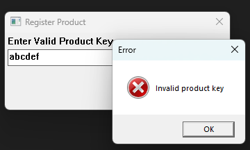
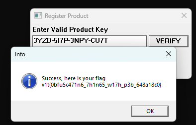

# V1t CTF 2025

## Duck Product Key

> My bro made a product with a product key checker. Can you, reverse it or figure out how it works?
>
>  Author: DavidP
>
> [`duck_product_key.exe`](duck_product_key.exe)

Tags: _rev_

## Solution
The challenge comes with an windows PE executable. When running the application we can see it is some kind of product key checker. 



The goal seems to be to find or generate a valid product key. After opening the file in `Binary Ninja` we can't find immediate traces of WinAPI calls which we would assume for the graphical UI.

One interesting bit is that we find a reoccuring pattern im code that suggests the API calls where obfuscated by a technique calls `PEB walking`. In short, the program walks manually through the loaded modules and functions and avoids therefore direct reference or linking to API calls. 

```c
140003e30 int64_t main()
0003e4e     void var_98
140003e4e     int64_t rax_1 = __security_cookie ^ &var_98
140003e67     int32_t var_48 = 0xd44c7ef9
140003e73     int32_t var_44 = 0xba131438
140003e80     int32_t var_40 = 0x193397
140003e88     int32_t var_3c = 0x2d10c88c
140003e90     int64_t rax_2 = sub_1400032a0(0x2d10c88c, &var_48, &data_1400081c0, 0xb)
140003e9d     struct _PEB_LDR_DATA* Ldr = sub_140004280()->Ldr
140003ea1     struct _LIST_ENTRY* Flink_3 = Ldr->InMemoryOrderModuleList.Flink
140003ea5     struct _LIST_ENTRY* Blink = Ldr->InMemoryOrderModuleList.Blink
140003eac     void* rdx_2
140003eac     
140003eac     if (Flink_3 == Blink)
140003f68         label_140003f68:
140003f68         rdx_2 = nullptr
140003eac     else
140003ec0         while (true)
140003ec0             void* r11_1 = Flink_3->__offset(0x20).q
140003ec8             uint64_t rcx = zx.q(*(sx.q(*(r11_1 + 0x3c)) + r11_1 + 0x88))
140003ec8             
140003ed2             if (rcx.d != 0)
140003edd                 void* rax_5 = r11_1 + rcx
140003eef                 int32_t rbx_1 = *(rax_5 + 0x18)
140003ef5                 uint64_t r10_1 = 0
// ...
```

Since the function table exposes the function names there has to be a string comparison that should expose which function is being looked up. To avoid this, the program uses a simple string obfuscation technique. 

We can see this in the following code part, the function name is hashed and compared against a hardcoded value. The algorithm used here looks like [`FNV-1a`](https://en.wikipedia.org/wiki/Fowler%E2%80%93Noll%E2%80%93Vo_hash_function).

```c
// ...
140003f0f int32_t r9_1 = 0x55366ad0;
140003f0f 
140003f1d do
140003f15     rcx_1 += 1;
140003f1d  while (*(uint8_t*)((char*)r8_2 + rcx_1));
140003f1d 
140003f1f void* rdx_1 = nullptr;
140003f1f 
140003f24 if (rcx_1)
140003f24 {
140003f45     do
140003f45     {
140003f30         int32_t rax_6 =
140003f30             (int32_t)*(uint8_t*)((char*)rdx_1 + r8_2);
140003f35         rdx_1 += 1;
140003f3b         r9_1 = (rax_6 ^ r9_1) * 0x1000193;
140003f45     } while (rdx_1 < rcx_1);
140003f45     
140003f4e     if (r9_1 == 0x146ed342)
140003f4e     {
14000420b         rdx_2 = (uint64_t)*(uint32_t*)(
14000420b             (uint64_t)*(uint32_t*)((char*)rax_5 + 0x1c) + r11_1
14000420b             + ((uint64_t)*(uint16_t*)(
14000420b             (uint64_t)*(uint32_t*)((char*)rax_5 + 0x24) + r11_1
14000420b             + (r10_1 << 1)) << 2)) + r11_1;
14000420e         break;
140003f4e     }
140003f24 }
// ...
```

As a proof of concept, we can implement this in python

```py
def fnv1a32(data: bytes, seed: int) -> int:
    hash_value = seed
    for byte in data:
        hash_value = ((hash_value ^ byte) * 0x01000193) & 0xffffffff
    return hash_value

def find_api_call(hash_value, seed) -> str:
    global dictionary
    for entry in dictionary:
        if fnv1a32(entry.encode(), seed) == hash_value:
            return entry
    return None

dictionary = open("dict.txt", "r").read().splitlines()

calls = [(0x55366ad0, 0x146ed342),
         (0x55366ad0, 0x9d3ba21e),
         (0x55366ad0, 0x498c95a5),
         (0x55366ad0, 0xaa90d368)]

for seed, hash_value in calls:
    name = find_api_call(hash_value, seed)
    print(f"0x{hash_value:08x}: {name if name != None else 'n/a'}")
```

For the dictionary we can just use a list of common used windows api calls or c library functions etc... When running this we get:

```bash
0x146ed342: LoadLibraryA
0x9d3ba21e: GetMessageA
0x498c95a5: TranslateMessage
0xaa90d368: DispatchMessageA
```

This brings a lot more transparency to the actual program flow and we can see, that the main function mostly implements a message pump and manually loads a dynamic link library.

Another technique in place is that string values are in general obfuscated, not just for the API lookups. For instance, the first call to `LoadLibraryA` takes a string value which is built like this:

```c
140003e67        int32_t var_48 = 0xd44c7ef9;
140003e73        int32_t var_44 = 0xba131438;
140003e80        int32_t var_40 = 0x193397;
140003e88        int32_t var_3c = 0x2d10c88c;
140003e90        int64_t rax_2 = sub_1400032a0(0x2d10c88c, &var_48, &data_1400081c0, 0xb);
/// ...
1400032a0    int64_t sub_1400032a0(int32_t seed, int64_t arg2, int64_t arg3, int32_t arg4)

1400032a0    {
1400032a0        int32_t i = 0;
1400032c3        int32_t state = seed;
1400032c3        
1400032db        for (; i < arg4; i += 1)
1400032db        {
1400032db            *(uint8_t*)(arg3 + (uint64_t)i) = *(uint8_t*)(arg2 + (uint64_t)i) ^ state;
140003303            state = sub_140003df0(state);
1400032db        }
1400032db        
140003312        return arg3;
1400032a0    }
/// ...
140003df0    uint64_t sub_140003df0(int32_t arg1) __pure

140003df0    {
140003df0        int32_t rcx = arg1 ^ arg1 << 0xd;
140003dfc        int32_t rcx_1 = rcx ^ rcx >> 0x11;
140003e21        return (uint64_t)((rcx_1 ^ rcx_1 << 5) % 0x7fffffff);
140003df0    }
```

The program uses a xorshift pseudo random number generator to generate a keystream. Implementing this in python let's us recover the strings easily:

```py
def xorshift(state: int) -> int:
    state ^= (state << 13) & 0xFFFFFFFF
    state ^= (state >> 17)
    state ^= (state << 5) & 0xFFFFFFFF
    return state % 0x7FFFFFFF

def decode_string(seed, data):
    result = ""
    rng = seed
    for byte in data:
        result += chr((byte ^ rng)&0xff)
        rng = xorshift(rng)
    return result


data = b"\xf9~L\xd48\x14\x13\xba\x973\x19\x8c\xc8\x10-"

print(decode_string(0x2d10c88c, data))
```

The full call therefore is `LoadLibraryA("user32.dll")`.

Thats for the `main` method. The `main` also calls into `sub_140002830`. Doing the same process there we find roughly this sequence.

```c
0x467b23f1: GetModuleHandleA
0xb5feee14: LoadIconA
0xa0067ffd: LoadCursorA
0x069a3250: GetSysColorBrush
0x61e7d986: RegisterClassA
0xdd6321f4: CreateWindowExA
0x77a1b499: ShowWindow
0xf70dc191: UpdateWindow
```

This is basically where the main window is created and the window class is initialized. As we know the `window procedure` is stored in the `window class`, which is used for register by `RegisterClassA` we can find the `window procedure` easily:

```c
14000294d        LRESULT (* var_b0)(HWND arg1, uint32_t arg2, WPARAM arg3) = sub_1400035a0;
```

We want to find the window procedure, since normally UI command handlers are dispatched from there by listening to `WM_COMMAND` messages. 

Deobfuscating the `PEB walking` bit gives us the following calls.

```c
0x1a27bf68: PostQuitMessage
0x713b0592: GetWindowTextA
0xb6c4e2db: MessageBoxA
0x1b0811c1: strcat
0x1b0811c1: strcat
0xb6c4e2db: MessageBoxA
```

Especially `GetWindowTextA` and `MessageBoxA` are interesting, because we know the program shows a message box after we click the `verify` button. 

By deobfuscating the string before the first call to `MessageBoxA` we find it is the message we already saw 

```c
MessageBoxA(hwnd, "Invalid product key", "Error", MB_OK | MB_ICONERROR)
```

This path is called when `sub_140003320` returns a `false` value, thus we can assume that this function does the `product key verification`. By following the function calls we find `sub_1400030e0` for being responsible of doing the product key format check. After deobfuscating we get the following:

```c
int IsProductKeyFormatValid(const char* key) 
{
    if (strlen(key) != 19) {
        return 0;
    }

    for (int i = 0; i < 19; ++i)
    {
        if ((i == 4 || i == 9 || i == 14)) 
        {
            if (key[i] != '-') return 0;
        }
        else 
        {
            if (Base32CharToValue(toupper(key[i])) == -1) {
                return 0;
            }
        }
    }
    return 1;
}
```

This gives is the following information. Product keys are 19 characters long, they have a `-` at position 5, 10 and 15. All other characters are from a upper case `base32` alphabet. So `AAAA-AAAA-AAAA-AAAA` would be a key that fits the format.

Of course, entering this key will give us the same `invalid` message, but at least we pass the first barrier.

The reason why the key still isn't accepted is that there is a simple integrity check in place:

```c
/// ...
140003564            if ((RORD(
140003564                    (RORD(
140003564                        (RORD((var_60 ^ 0x7b081b4a) * 0x45d9f3b, 0x13) ^ var_5c)
140003564                            * 0x45d9f3b, 
140003564                        0x13) ^ var_58) * 0x45d9f3b, 
140003564                    0x13) & 0xfffff) != var_54)
140003583                result = 0;
/// ...
```

This code associates the first three key segments with the last segment. We can generate keys with a valid signature ourself with the following.

```py
BASE32_ALPHABET = "ABCDEFGHIJKLMNOPQRSTUVWXYZ234567"

def base32_char_to_value(c: str) -> int:
    c = c.upper()
    if 'A' <= c <= 'Z':
        return ord(c) - ord('A')
    if '2' <= c <= '7':
        return ord(c) - ord('2') + 26
    return -1


def base32_block_to_int(block: str) -> int:
    value = 0
    for c in block:
        v = base32_char_to_value(c)
        if v == -1:
            raise ValueError(f"Invalid Base32 character: {c}")
        value = (value << 5) | v
    return value


def int_to_base32_block(value: int, part_length: int = 4) -> str:
    chars = [''] * part_length
    for i in range(part_length - 1, -1, -1):
        chars[i] = BASE32_ALPHABET[value & 31]
        value >>= 5
    return ''.join(chars)


def simple_signature(data):
    hash_val = 0x7b081b4a
    for value in data:
        hash_val ^= value
        hash_val = (hash_val * 0x45d9f3b) & 0xFFFFFFFF
        hash_val = ((hash_val << 13) | (hash_val >> 19)) & 0xFFFFFFFF
    return hash_val & 0xFFFFF

def generate_key(parts):
    key = [base32_block_to_int(part) for part in parts]
    signature = int_to_base32_block(simple_signature(key))
    return f"{parts[0]}-{parts[1]}-{parts[2]}-{signature}"

print(generate_key(["AAAA", "AAAA", "AAAA"]))
```

This gives us a key that should pass the test: `AAAA-AAAA-AAAA-T65D`. But sadly enough, this is not doing the trick again.

The reason for this is in the last check. The program calculates in function `sub_140001080` a `md5 checksum` over the high 8 bits of every key segment. The checksum is a 32 bit value, that is the xor of all 4 md5 states, and is assumed to be equal to `0x367f45a8`.

```c
14000357a result_1 = sub_140001080(arg2, 12) == 0x367f45a8;
```

Since the input is only 3 bytes we can brute force the key easily.

```py
import hashlib
import struct

TARGET = 0x367f45a8

le4 = [i.to_bytes(4, "little") for i in range(256)]

def checksum_for_triple(a, b, c):
    data = le4[a] + le4[b] + le4[c]
    md5 = hashlib.md5(data).digest()
    w0, w1, w2, w3 = struct.unpack("<IIII", md5)
    return w0 ^ w1 ^ w2 ^ w3

def main():
    count = 0
    for a in range(256):
        for b in range(256):
            for c in range(256):
                count += 1
                chk = checksum_for_triple(a, b, c)
                if chk == TARGET:
                    print(f"Match found: a=0x{a:02x}, b=0x{b:02x}, c=0x{c:02x}")
                    return
    print("No match found.")

if __name__ == "__main__":
    main()
```

Running this gives us the result `Match found: a=0xde, b=0xea, c=0xdb`. The final step is to use these bytes as part of the key (8 high bits per segment each).

```py
def generate_key():
    xor_bytes = [0xde, 0xea, 0xdb]
    key = []
    for i in range(len(xor_bytes)):
        value = (xor_bytes[i] << 12) | random.getrandbits(12)
        key.append(value)
    key.append(simple_signature(key))

    return "-".join([int_to_base32_block(block) for block in key])
```

Running this gives us working product keys. To verify this we can enter the key into the key checker.



Flag `v1t{0bfu5c471n6_7h1n65_w17h_p3b_648a18c0}`
