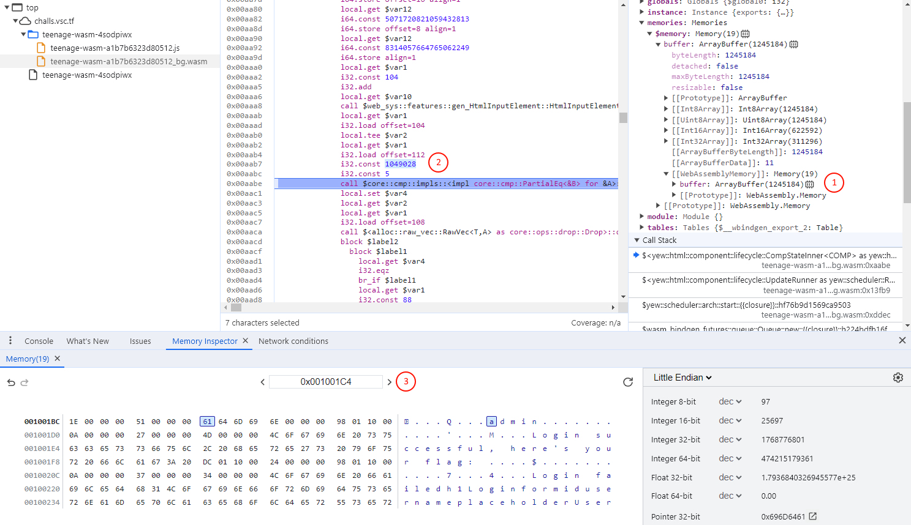

# vsCTF 2023

## teenage-wasm

> baby (basic) wasm from vsCTF 2022 is all grown up and more secure than ever!
>
>  Author: jayden
>

Tags: _rev_

## Solution
We get link to a webpage for this challenge. Following the link we see a login form. Trying some random values for username and password leads to a `Login failed` message.

When opening the `devtools` in chrome we can see that there is a `wasm` module and some binding `js` code. In the javascript code we find the following function that is used to pass string values to the wasm module. We set a breakpoint here and check where things are coming from.

```javascript
function passStringToWasm0(arg, malloc, realloc) {

    if (realloc === undefined) {
        const buf = cachedTextEncoder.encode(arg);
        const ptr = malloc(buf.length, 1) >>> 0;
        getUint8Memory0().subarray(ptr, ptr + buf.length).set(buf);
        WASM_VECTOR_LEN = buf.length;
        return ptr;
    }

    let len = arg.length;
    let ptr = malloc(len, 1) >>> 0;

    const mem = getUint8Memory0();

    let offset = 0;

    for (; offset < len; offset++) {
        const code = arg.charCodeAt(offset);
        if (code > 0x7F) break;
        mem[ptr + offset] = code;
    }

    if (offset !== len) {
        if (offset !== 0) {
            arg = arg.slice(offset);
        }
        ptr = realloc(ptr, len, len = offset + arg.length * 3, 1) >>> 0;
        const view = getUint8Memory0().subarray(ptr + offset, ptr + len);
        const ret = encodeString(arg, view);

        offset += ret.written;
    }

    WASM_VECTOR_LEN = offset;
    return ptr;
}
```

The stack trace is something like:

```
passStringToWasm0
imports.wbg.__wbg_value_9423da9d988ee8cf
$web_sys::features::gen_HtmlInputElement::HtmlInputElement::value::h751aea454b022730 
$<yew::html::component::lifecycle::CompStateInner<COMP> as yew::html::component::lifecycle::Stateful>::flush_messages::hab7601c7c355399c
...
```

The string was requested by the wasm module, to see what is happening with it we can follow along by stepping through the code. Three levels up we are in the function `func $<yew::html::component::lifecycle::CompStateInner<COMP> as yew::html::component::lifecycle::Stateful>::flush_messages::hab7601c7c355399c (;84;) (param $var0 i32) (result i32)` which looks interesting since the value (username) just read is compared afterwards and then the password is requested followed by another comparison.



Just before the comparison function is called we have four values on our stack which are passed as parameters to the compare function.

```
0: i32 {value: 1162736}
1: i32 {value: 4}
2: i32 {value: 1049028}
3: i32 {value: 5}
```

We can check the parameters. To look up string values we add the `WebAssemblyMemory` (1) to the `Memory inspector`. Then we copy the address (2) to the textfield (3) and hit enter. We can see that the first string at `1162736` is the value we entered `test` and the second string is the value hardcoded in code `admin`. So our user should be `admin`.

If we continue stepping the comparison will fail and the function will eventually early out. Therefore we need to restart with the correct username. So lets do this: type `admin` as user and keep `test` (or whatever you like, really) as password and set a breakpoint to the comparison.

We can see that this time the username check is successful. When we continue stepping the password is requested and then a second compare is done. The setup is exactly like before.

```
0: i32 {value: 1162736}
1: i32 {value: 4}
2: i32 {value: 1234540}
3: i32 {value: 41}
```

The first parameter is our password `test` and the second parameter is the actual password. Looking up in the memory inspector we see `ilovewasm1337_bFrbqmwZMjpZgyotwJgX4qtWXQz`. Now we have both, username and password we close the devtools again and login to get the flag.

```
Login successful, here's your flag: "vsctf{w4sm_is_n0t_aw3some_pWuTMXJmq2KwNN}"
```

Flag `vsctf{w4sm_is_n0t_aw3some_pWuTMXJmq2KwNN}`