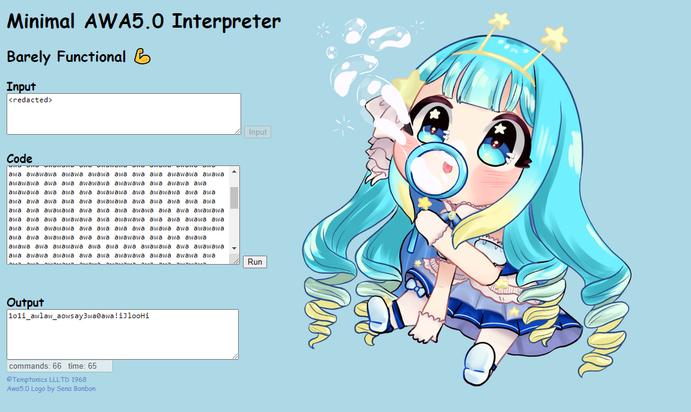

# vsCTF 2024

## awa-jelly

> [`JellyCTF`](https://jellyc.tf/) has some amazing challenges on [`Jelly Hoshiumi`](https://x.com/jellyhoshiumi) (星海ジェリー), one of the few VTubers who loves CTF. Inspired by a challenge, I made one based on [`AWA5.0`](https://github.com/TempTempai/AWA5.0). Can you find the redacted input that matches the screenshot?
>
>  Author: sahuang
>
> [`awawa.txt`](awawa.txt)

Tags: _rev_

## Solution
This challenge comes with a text file that contains apparently an `AWA5.0` program. The documentation of the language can be found [`here`](https://github.com/TempTempai/AWA5.0/blob/main/Documentation/AWA5.0%20Specification.pdf), but it's pretty simple:

The code is a series of `awa` commands where `awa` really is interpreted as `0` and `wa` is interpreted as `1`. So it's a weird way to encode a bitstream. The bitstream itself is encoded as sequence of commands (`awatisms`). The language encodes command ids in 5 bits, so there is space for 32 awatisms in theory, but actually 22 awatisms exist and the rest is currently not specified.

AWA5.0 uses a stack that is called `Bubble Abyss`. The stack has first in last out (LIFO) structure. The stack contains bubbles that have a value attached or bubbles that contain a variable amount of bubbles themself, called double bubbles.

Also the language uses a own character encoding scheme called `AwaSCII`. The scheme is missing some characters of the latin alphabet (they call it improvement over ASCII).

The last thing worth mentioning is that commands can have arguments of variable length (the length is fixed per command, but can vary between commands). Here's a quick overview.

```bash
id          command     argument    decription
0x00        nop                     no operation
0x01        prn                     print top bubble as char/string
0x02        pr1                     print top bubble as number
0x03        red                     read string
0x04        r3d                     read number 
0x05        blo         s8          push new bubble with value
0x06        sbm         u5          pushes top-most bubble down 'X' positions
0x07        pop                     pop top bubble
0x08        dpl                     doublicate top-most bubble
0x09        srn         u5          surround top 'X' bubbles in a double bubble
0x0A        mrg                     packs stack content into a double bubble
0x0B        4dd                     adds content of top two bubbles
0x0C        sub                     subtracts content of top two bubbles
0x0D        mul                     multiplies content of top two bubbles
0x0E        div                     divides content of top two bubbles
0x0F        cnt                     pushes a new bubble, value will be current size of stack
0x10        lbl         u5          label for jumps
0x11        jmp         u5          jump to label
0x12        eql                     compares top two bubbles, if not equal skip next command
0x13        lss                     compares top two bubbles, if not less skip next command
0x14        gr8                     compares top two bubbles, if not greater skip next command
0x1F        trm                     marks end of program
```

Alright, with this we can write a quick *decompiler* that will print out some disassembly like representation that actually is readable.

```python
COMMAND_BITS = 5

def parseBlock(block):
    result = ""
    while len(block) != 0:
        if block.startswith("awa"):
            result += "0"
            block = block[3:]
        elif block.startswith("wa"):
            result += "1"
            block = block[2:]
    return result

def awaize(bits, size):
    tmp = []
    while bits != 0:
        tmp.append(" awa" if bits & 1 == 0 else "wa")
        bits >>= 1

    for i in range(len(tmp), size):
        tmp.append(" awa")

    return "".join(tmp[::-1]).strip()

def parseBits(index, data, length):
    return (index+length, int(data[index:index+length],2))

commands = {
                0x00: ("nop", 0),
                0x01: ("prn", 0),
                0x02: ("pr1", 0),
                0x03: ("red", 0),
                0x04: ("r3d", 0),
                0x05: ("blo", 8),
                0x06: ("sbm", 5),
                0x07: ("pop", 0),
                0x08: ("dpl", 0),
                0x09: ("srn", 5),
                0x0A: ("mrg", 0),
                0x0B: ("4dd", 0),
                0x0C: ("sub", 0),
                0x0D: ("mul", 0),
                0x0E: ("div", 0),
                0x0F: ("cnt", 0),
                0x10: ("lbl", 5),
                0x11: ("jmp", 5),
                0x12: ("eql", 0),
                0x13: ("lss", 0),
                0x14: ("gr8", 0),
                0x1F: ("trm", 0),
           }

def handleCommand(index, data, cmd, awaized):
    try:
        cmd_info = commands[cmd]
        if cmd_info[1] != 0:
            index, param = parseBits(index, data, cmd_info[1])
            disasm = f"{cmd_info[0]} {param}"
        else:
            disasm = cmd_info[0]

        if awaized:
            param = f" | {awaize(param, cmd_info[1])}" if cmd_info[1] != 0 else ""
            print(f"{(awaize(cmd, COMMAND_BITS)+param).ljust(42)} {disasm}")
        else:
            print(disasm)
    except:
        print(f"unknown command {cmd}")

    return index

if __name__ == "__main__":
    data = open("awawa.txt", "r").read().split(" ")

    bits = ""
    for block in data[1:]:
        bits += parseBlock(block)

    index = 0
    while index < len(bits):
        index, cmd = parseBits(index, bits, COMMAND_BITS)
        index = handleCommand(index, bits, cmd, True)
```

If we run the program it gives us the following:

```bash
awa awa awawawa                            red      # reads the flag from input and pushes the characters into a "double bubble" into the stack
awa awawawawa                              pop      # pops the double bubble, this means it expands the flag characters into the stack. the stack contains the flag by then
awa awawawa awa | awa awa awawa awa        sbm 2    # shifts the top-most item down 2 postions
awa awawawa awa | awa awa awawawa          sbm 3    # shifts the top-most item down 3 positions
awa awawawa awa | awa awawa awa awa        sbm 4    # etc...
awa awawawa awa | awa awa awa awawa        sbm 1
awa awawawa awa | awa awawawa awa          sbm 6
awa awawawa awa | awa awawa awawa          sbm 5
awa awawawa awa | awa awa awawawa          sbm 3
awa awawawa awa | awawa awawa awa          sbm 10
awa awawawa awa | wa awawa awa awa         sbm 20
awa awawawa awa | wa awawawa awa           sbm 22
awa awawawa awa | wawa awa awawa           sbm 25
awa awawawa awa | awa awa awawawa          sbm 3
awa awawawa awa | awa awa awa awa awa      sbm 0
awa awawawa awa | awa awa awa awa awa      sbm 0
awa awawawa awa | awa awa awawa awa        sbm 2
awa awawawa awa | awa awa awawawa          sbm 3
awa awawawa awa | awa awawa awa awa        sbm 4
awa awawawa awa | awa awa awa awawa        sbm 1
awa awawawa awa | awa awawawa awa          sbm 6
awa awawawa awa | awa awawa awawa          sbm 5
awa awawawa awa | awa awa awawawa          sbm 3
awa awawawa awa | awawa awawa awa          sbm 10
awa awawawa awa | wa awawa awa awa         sbm 20
awa awawawa awa | wa awawawa awa           sbm 22
awa awawawa awa | wawa awa awawa           sbm 25
awa awawawa awa | awa awa awawawa          sbm 3
awa awawawa awa | awa awa awa awa awa      sbm 0
awa awawawa awa | awa awa awa awa awa      sbm 0
awa awawawa awa | awa awa awa awa awa      sbm 0
awa awawawa awa | wa awa awa awa awa       sbm 16
awa awawawa awa | wawa awawa awa           sbm 26
awa awawawa awa | wawawawawa               sbm 31
awa awa awa awawa                          prn       # prints first item on the stack
awa awa awa awawa                          prn       # prints second item on the stack
awa awa awa awawa                          prn       # ...
awa awa awa awawa                          prn
awa awa awa awawa                          prn
awa awa awa awawa                          prn
awa awa awa awawa                          prn
awa awa awa awawa                          prn
awa awa awa awawa                          prn
awa awa awa awawa                          prn
awa awa awa awawa                          prn
awa awa awa awawa                          prn
awa awa awa awawa                          prn
awa awa awa awawa                          prn
awa awa awa awawa                          prn
awa awa awa awawa                          prn
awa awa awa awawa                          prn
awa awa awa awawa                          prn
awa awa awa awawa                          prn
awa awa awa awawa                          prn
awa awa awa awawa                          prn
awa awa awa awawa                          prn
awa awa awa awawa                          prn
awa awa awa awawa                          prn
awa awa awa awawa                          prn
awa awa awa awawa                          prn
awa awa awa awawa                          prn
awa awa awa awawa                          prn
awa awa awa awawa                          prn
awa awa awa awawa                          prn
awa awa awa awawa                          prn
awa awa awa awawa                          prn
```

Another thing that came with the challenge was an screenshot of [`Minimal AWA5.0 Interpreter`](https://temptempai.github.io/AWA5.0/), containing the program and a output. The input was redacted and probably the flag we need to find.



The given output is basically just a shuffled version of the input. If we want to find the input we have multiple ways to do this. We can just input a "known string" with the same length as the output and see at which position the characters end up after running the program. Then map back the characters of the actual output. Or just take the actual output and `undo` the shuffle operations.

```python
data = list("1o1i_awlaw_aowsay3wa0awa!iJlooHi")
subm = [2, 3, 4, 1, 6, 5, 3, 10, 20, 22, 25, 3, 0, 0, 2, 3, 4, 1, 6, 5, 3, 10, 20, 22, 25, 3, 0, 0, 0, 16, 26, 31]

for i in subm[::-1]:
    if i != 0:
        data = [data[i]] + data[0:i] + data[i+1:]
    else:
        data.insert(0, data[-1])
        data = data[:-1]

print("".join(data))
```

Running this gives us `J3lly_0oooosHii11i_awawawawaawa!`, after surrounding with `vsctf{}` we have the flag.

Flag `vsctf{J3lly_0oooosHii11i_awawawawaawa!}`