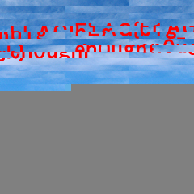
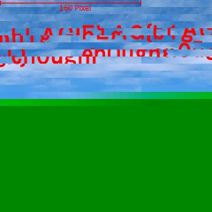

# WaniCTF 2024

## tiny_10px

> What a small world!
>
>  Author: Mikka
>

Tags: _forensics_

## Solution
For this challenge we get a `JPEG image`. Running `file` on it gives us the informations.

```bash
JPEG image data, Exif standard: [TIFF image data, big-endian, direntries=4, xresolution=76, yresolution=84, resolutionunit=2], baseline, precision 8, 10x10, components 3
```

With `~45K` the file seems a bit too large for a `10x10 pixel` image, so the idea is to play around with the image size. `JPEG` images consist of a sequence of segments, whereas each segment is marked with it's own magic value. Every of the `markers` starts with `0xFF` and is followed by one byte that indicates the marker. Typically things are starting with marker `Start Of Image` (`0xFFD8`). This marker doesn't have any payload so the next marker comes right after. In our case it's `0xFFE1` which is used by `Exif files` and allows to add additional informations compared to `JPEG`. `Exif` uses the range `0xFFE0-0xFFEF` and calls the markers `Application Markers`. Those markers specify metadata and are *not* necessary to decode the image. 

So we quickly forget about them, but every `APP` marker stores 16 bits after the magic value that tells us how large the data is. So we can jump from one marker to the next, first `APP1 (117 bytes)` then `APP2 (3160 bytes)` and finally `APPD (44 bytes)`.

The next two markers defines `Define Quantization Table(s)` (`0xFFDB`) and are the first `JPEG` markers. Followed by `Start Of Frame` (`0xFFC0`) which specifies with, height, number of channels per pixel, etc... This is the marker we are looking for, if we want to tweak the image dimensions.

`SOF0` contains the following informations:

```bash
2 bytes     identifier              0xFF 0xC0
2 bytes     length                  0x00 0x11
1 byte      bits per pixel          0x08
2 byte      image height            0x00 0x0A
2 byte      image width             0x00 0x0A
1 byte      number of components    0x03
9 byte      sampling information    0x01 0x11 0x00
                                    0x02 0x11 0x01
                                    0x03 0x11 0x01
```

We can see, width and height are set to 10 pixels each. We also see the sampling factors for (Y=1, Cb=2 and Cr=3) which are `1:1` for every component (second byte of the sampling informations stores vertical factor in low nibble and horizontal factor in hight nibble) which gives us `YCbCr4:4:4` which leads a `MCU` (minimum coded unit) of `8x8 pixels`, meaning data is decoded in 8x8 pixel blocks. This is nice, since it helps us to find the correct image dimensions, which need to be multiple of 8 in every direction.

Lets try this, setting width to 240 and height to 240 gives us the following:



Nice, there is definitely some hidden data, but our dimensions are not working out yet. But we can see quite clearly where the rows should break (at 160 pixels).



So, lets set the width to 160 pixels instead to line things up neatly. We still can see there is empty space which doesn't contain valid informations. We *can* decrease this until the grey space disappears. All in all our image has data for a resolution of `160x160 pixels`. And the result gives us the flag.


Flag `FLAG{b1g_en0ugh}`